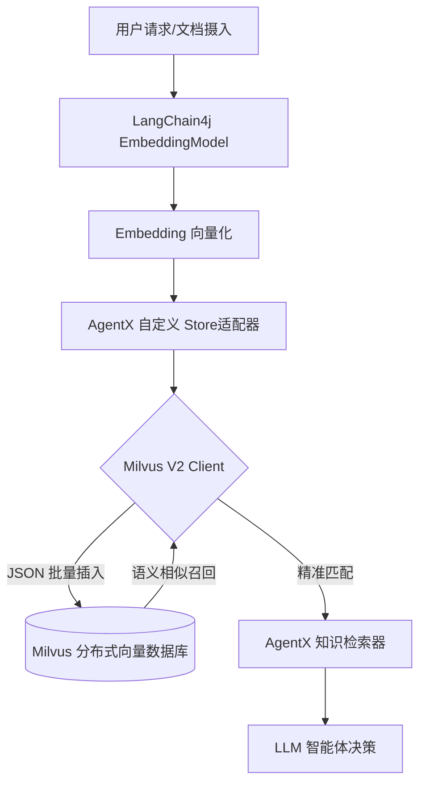

这是一个结合了 **Spring Boot 3.4.4** 最新特性、**Java 21 虚拟线程**性能优化、以及 **Milvus V2 原生 SDK** 深度集成的 AgentX 核心基础设施工程文档。

---

# AgentX 工程实战：基于 Spring Boot 3.4.4 与 Milvus V2 SDK 的向量化存储基建

## 1. 架构概览 (Architecture Overview)

AgentX 是一个面向企业级场景的 AI Agent 框架，采用高可用的分布式架构，基于 **Java 21** 与 **Spring Boot 3.4.4** 构建。在核心的向量存储层，我们摒弃了传统的适配器模式，通过原生 **Milvus V2 Client** 实现对底层基础设施的完全掌控，确保在高并发 RAG（检索增强生成）场景下的极致性能。

### 核心架构流转图


---

## 2. 基础设施优化 (Infrastructure Hardening)

### 2.1 虚拟线程 (Virtual Threads) 的革命性提效
在 Java 21 环境下，Agent 并发调用（模型、数据库、工具链）不再受限于传统线程池。
```yaml
# application.yml
spring:
  threads:
    virtual:
      enabled: true # 开启虚拟线程，极大提升 I/O 密集型任务吞吐量
```

### 2.2 Redis 序列化与持久化配置
为了解决可视化工具查看时的乱码问题，并支持 Java 8 时间 API，我们重写了 Redis 序列化逻辑：
```java
@Bean
public RedisTemplate<String, Object> redisTemplate(RedisConnectionFactory factory) {
    RedisTemplate<String, Object> template = new RedisTemplate<>();
    template.setConnectionFactory(factory);
    
    ObjectMapper om = new ObjectMapper();
    om.registerModule(new JavaTimeModule()); // 解决 LocalDateTime 序列化
    om.activateDefaultTyping(LaissezFaireSubTypeValidator.instance, 
                             ObjectMapper.DefaultTyping.NON_FINAL, 
                             JsonTypeInfo.As.PROPERTY); // 保留类型信息

    Jackson2JsonRedisSerializer<Object> serializer = new Jackson2JsonRedisSerializer<>(om, Object.class);
    template.setKeySerializer(RedisSerializer.string());
    template.setValueSerializer(serializer);
    return template;
}
```

### 2.3 LangChain4j HTTP 客户端冲突修复
**挑战**：LangChain4j 1.13.0+ 在 Spring 环境下会因扫描到多个 HTTP 客户端（JDK vs RestClient）而抛出 `IllegalStateException`。
**解法**：在启动类强制指定工厂，并在 POM 中剔除冲突依赖。
```java
public static void main(String[] args) {
    System.setProperty("langchain4j.http.clientBuilderFactory", 
        "dev.langchain4j.http.client.spring.restclient.SpringRestClientBuilderFactory");
    SpringApplication.run(AgentXApplication.class, args);
}
```

---

## 3. 向量数据库：Milvus V2 深度实践

### 3.1 防御性初始化与数据库自愈
针对 Milvus 不会自动创建数据库的特性，我们在配置类中增加了自动检查逻辑，并处理了分布式环境下的元数据同步延迟。

```java
@Bean(destroyMethod = "close")
public MilvusClientV2 milvusClientV2() {
    // 1. 防御性初始化：先连 default 库检查目标库是否存在
    ConnectConfig rootConfig = ConnectConfig.builder().uri(properties.getUri()).dbName("default").build();
    try (MilvusClientV2 tempClient = new MilvusClientV2(rootConfig)) {
        if (!tempClient.listDatabases().contains(properties.getDatabaseName())) {
            log.info("Creating Database: {}", properties.getDatabaseName());
            tempClient.createDatabase(CreateDatabaseReq.builder().databaseName(properties.getDatabaseName()).build());
            // 💡 架构师经验：Milvus 元数据同步存在延迟，强制等待确保所有实例可见
            Thread.sleep(3500); 
        }
    }
    
    // 2. 正式建立业务库连接
    return new MilvusClientV2(ConnectConfig.builder()
            .uri(properties.getUri())
            .dbName(properties.getDatabaseName())
            .build());
}
```

### 3.2 生产级适配器：MilvusV2EmbeddingStore
我们重写了批量插入逻辑，利用 V2 协议的 JSON 格式支持，实现高性能 IO。

```java
/**
 * 💡 AgentX 独家定制：基于 Milvus V2 协议的向量存储
 * - 复用批量插入逻辑，保证高性能 IO
 * - 高精度 Double 转换，兼容 LangChain4j 标准
 */
@Override
public void addAll(List<String> ids, List<Embedding> embeddings, List<TextSegment> embedded) {
    if (embeddings == null || embeddings.isEmpty()) return;

    List<JsonObject> rows = new ArrayList<>();
    for (int i = 0; i < embeddings.size(); i++) {
        JsonObject data = new JsonObject();
        data.addProperty("id", ids.get(i));
        data.add("vector", gson.toJsonTree(embeddings.get(i).vector()));
        // 防御性处理：防止 TextSegment 为空导致的插入失败
        data.addProperty("text", (embedded != null && embedded.size() > i) ? embedded.get(i).text() : "");
        rows.add(data);
    }

    milvusClientV2.insert(InsertReq.builder()
            .collectionName(collectionName)
            .data(rows)
            .build());
}
```

---

## 4. 架构师性能优化笔记

### 4.1 最小化网络负载 (Zero-Vector Payload)
在 `search` 实现中，我们在返回 `EmbeddingMatch` 时将向量数据 (Vector) 设为 `null`。
*   **性能逻辑**：在 RAG 场景中，LLM 仅需文本内容。传输 1024 维的高维浮点数组（约 4KB/条）会造成巨大的网络带宽浪费和不必要的内存 GC 压力。通过仅声明输出 `id` 和 `text` 字段，实现召回响应速度（TTFT）的极致提升。

### 4.2 类型安全与精度一致性
Milvus V2 底层原生使用 `Float`，而 LangChain4j 接口要求 `Double`。
*   **工程取舍**：通过 `(double) res.getScore()` 进行显式转换，确保在满足 Java 强类型校验的同时，不丢失相关性得分精度，为后续 **Re-Ranker (重排序)** 模型提供可靠输入。

---

## 5. 项目路线图 (Project Roadmap)

*   **[已完成]** 核心基础设施搭建，解决 Redis/Milvus/LangChain4j 启动冲突。
*   **[进行中]** 混合检索演进：引入稀疏向量 (Sparse Vector)，攻克财务表格等复杂文本的召回准确率。
*   **[待开发]** 多模态 Agent：接入图片、音视频的向量化存储与多维检索。

---
> **版权声明**：本文基于 AgentX 项目工程实践整理，由核心开发团队发布。相关代码逻辑及架构图受项目版本管理控制。
> **技术栈版本回溯**：Spring Boot 3.4.4 / Java 21 / Milvus 2.6.17 / LangChain4j 1.13.0