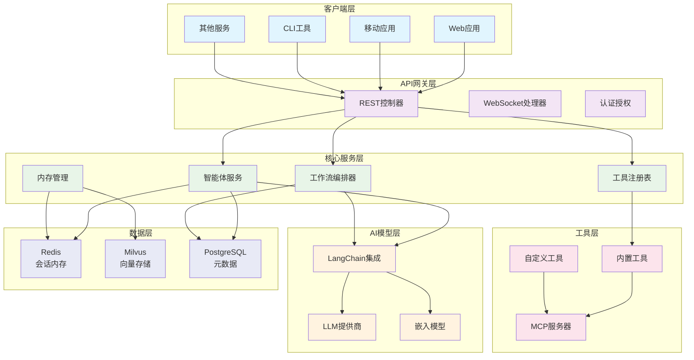
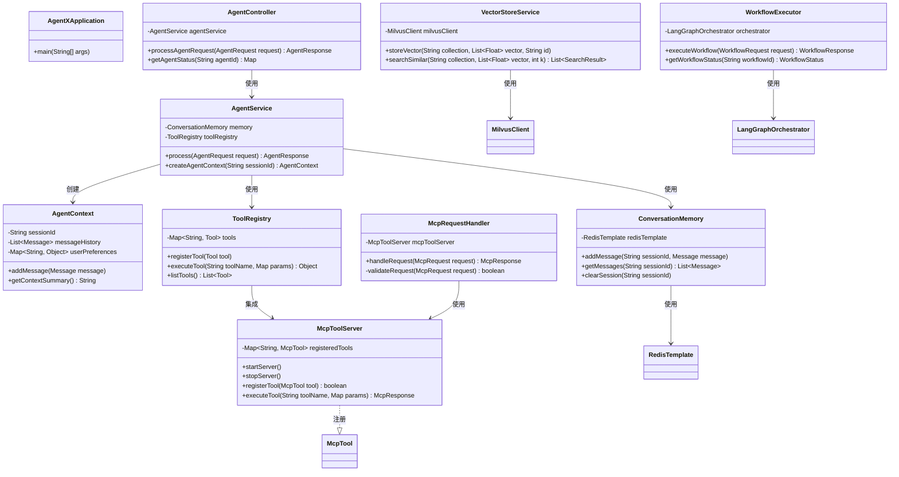
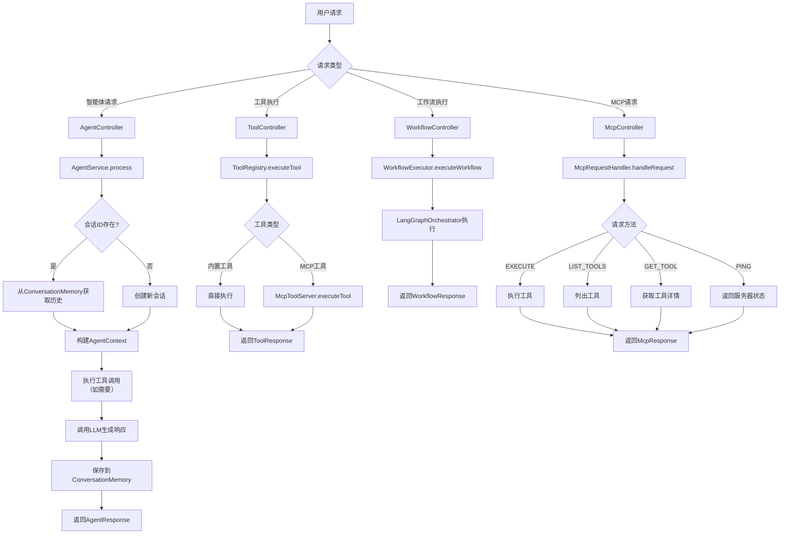
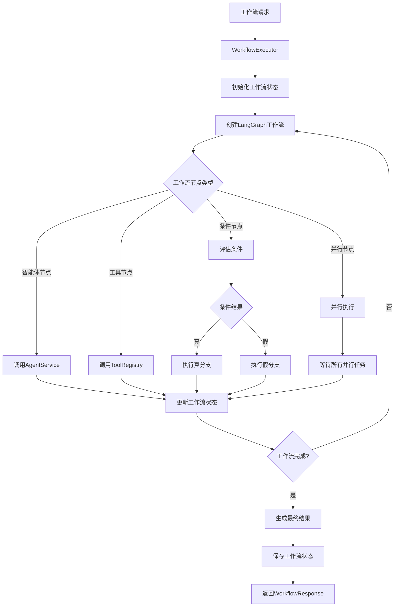
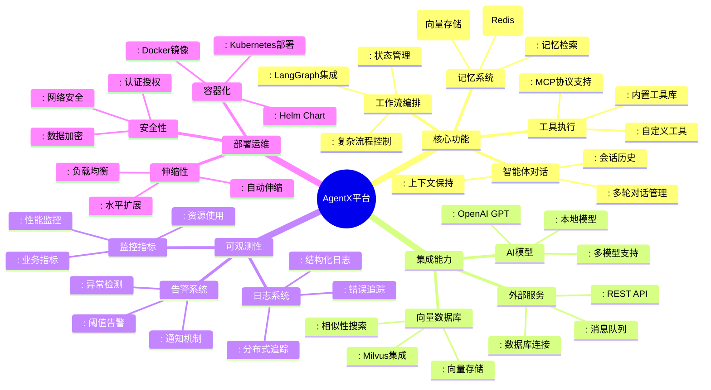
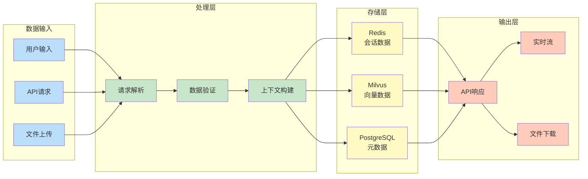
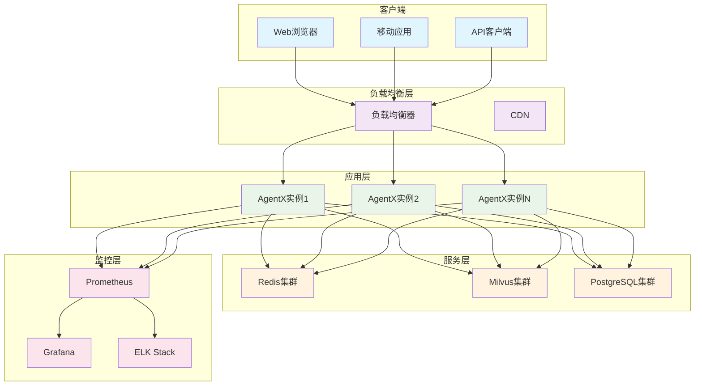

# AgentX 图表文档

## 1. 系统架构图

基于分层架构，展示AgentX平台的组件和交互。

## 2. 类图（核心类）

展示AgentX平台的核心Java类及其关系。

## 3. 请求处理流程图

展示用户请求在AgentX平台中的处理流程。

## 4. 工作流执行流程图

展示LangGraph工作流的执行过程。

## 5. 产品功能结构图

展示AgentX平台的产品功能模块。

## 6. 数据流图

展示数据在AgentX平台中的流动。

## 7. 部署架构图

展示AgentX在生产环境中的部署架构。

## 使用说明

1. 这些图表使用Mermaid语法编写，可以在支持Mermaid的Markdown查看器中直接渲染
2. 支持Mermaid的常见平台：
   - GitHub/GitLab Markdown
   - VS Code（安装Mermaid插件）
   - Mermaid Live Editor（在线编辑）
3. 如需修改图表，可直接编辑对应的Mermaid代码块
4. 图表定期更新，确保与代码架构同步

## 图表版本

- 生成时间：2026年4月12日
- 对应代码版本：AgentX 1.0.0
- 最后更新：2026年4月12日