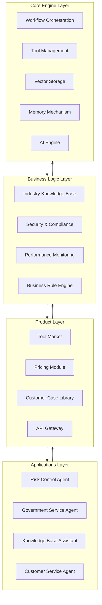
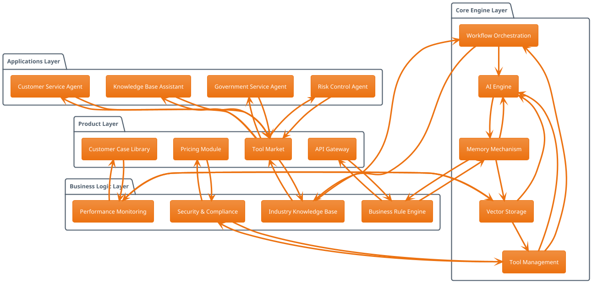

# 🏗️ AgentX Framework 项目架构图


---

## 📊 架构图说明

### 四层架构设计

#### **第1层：应用层 (Applications)**
- **Risk Control Agent** - 风控智能体：金融风控场景应用
- **Government Service Agent** - 政务智能体：政务服务场景应用
- **Knowledge Base Assistant** - 知识库助手：企业知识管理应用
- **Customer Service Agent** - 客服智能体：智能客服场景应用

#### **第2层：产品层 (Product)**
- **Tool Market** - 工具市场：10+开箱即用工具
- **Pricing Module** - 定价模块：商业化定价策略
- **Customer Case Library** - 客户案例库：增强客户信任
- **API Gateway** - API网关：统一接口管理

#### **第3层：业务层 (Business Logic)**
- **Industry Knowledge Base** - 行业知识库：金融/政务领域知识
- **Security & Compliance** - 安全合规：敏感词过滤+审计日志
- **Performance Monitoring** - 性能监控：低配服务器优化
- **Business Rule Engine** - 业务规则引擎：风控规则等

#### **第4层：核心层 (Core Engine)**
- **Workflow Orchestration** - 工作流编排：条件分支、循环等
- **Tool Management** - 工具管理：Function Calling集成
- **Vector Storage** - 向量存储：Milvus集成
- **Memory Mechanism** - 记忆机制：对话历史+上下文
- **AI Engine** - AI引擎：Spring AI + LangChain

---

## 🔄 数据流向

### 自上而下（请求流）
```
用户请求 → 应用层 → 产品层 → 业务层 → 核心层 → AI处理
```

### 自下而上（响应流）
```
AI结果 → 核心层 → 业务层 → 产品层 → 应用层 → 用户
```

---

## 🎨 架构特点

### 1. **分层清晰**
- 每层职责明确，降低耦合度
- 便于维护和扩展
- 支持模块化开发

### 2. **垂直领域优化**
- 业务层深度集成金融/政务逻辑
- 工具市场针对垂直场景优化
- 安全合规符合行业标准

### 3. **低配服务器支持**
- 核心层针对2C4G优化
- 性能监控实时调整
- 缓存机制提升效率

### 4. **可扩展性强**
- 工具市场支持自定义工具
- 工作流引擎支持复杂逻辑
- API网关支持多租户

---

## 💡 使用建议

### 文档中使用
将此架构图添加到以下文档：
- ✅ README.md（项目介绍部分）
- ✅ docs/architecture.md（架构设计文档）
- ✅ 技术博客（架构说明部分）
- ✅ 演示PPT（架构介绍页）

### 演示中使用
- 在项目介绍时展示整体架构
- 说明各层职责和数据流向
- 强调垂直领域优化特点

### 开发中使用
- 作为代码结构设计参考
- 指导模块划分和接口定义
- 帮助新成员快速理解项目

---

## 📝 架构图源文件

### Mermaid代码（可用于Markdown）



### PlantUML代码（可用于专业文档）



---

## 🚀 下一步建议

1. **将架构图添加到README**：在项目介绍部分展示
2. **创建详细架构文档**：说明每层的技术实现
3. **制作部署架构图**：展示Docker容器部署结构
4. **创建数据流程图**：详细说明数据处理流程

---

**这张架构图已经为你生成好了，可以直接用于项目文档和演示！** 它清晰地展示了AgentX Framework的四层架构设计，突出了垂直领域优化和低配服务器支持的特点。

需要我帮你：
- 生成部署架构图
- 制作数据流程图
- 创建组件详细设计图
请告诉我具体需要哪一项！