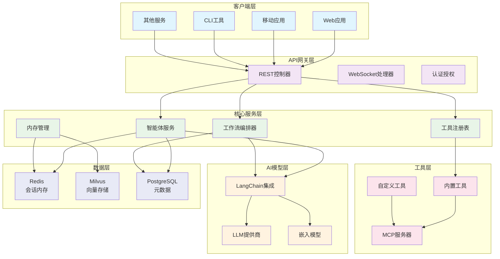
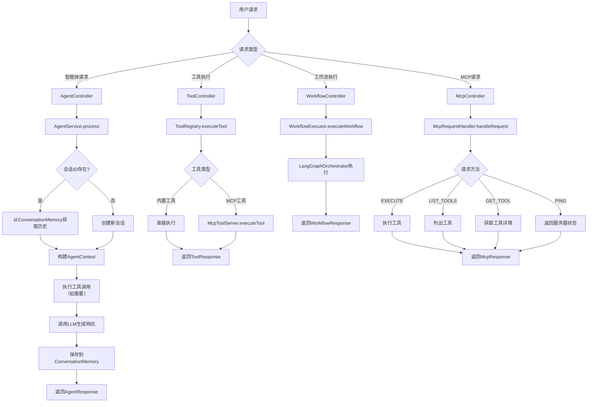

# 系统架构图

AgentX 采用分层架构设计，确保各层职责清晰、耦合度低，便于扩展和维护。本章详细说明整体架构和组件关系。

## 整体架构

AgentX 的架构分为六层，从上到下依次是：客户端层、API 网关层、核心服务层、AI 模型层、工具层和数据层。

## 架构层详解

### 1. 客户端层（Client Layer）

**职责**：提供多样化的用户交互界面和接入方式

**组件**：
- **Web 应用**：基于 Vue3/React 的前端应用，提供可视化操作界面
- **移动应用**：iOS/Android 原生应用或跨平台应用（Flutter/React Native）
- **CLI 工具**：命令行工具，便于自动化和脚本调用
- **其他服务**：第三方系统通过 API 集成

**设计考虑**：
- 多种客户端适配不同使用场景
- 统一的 API 接口，降低客户端开发成本
- 支持实时通信（WebSocket）和批量处理

### 2. API 网关层（API Gateway Layer）

**职责**：处理所有外部请求，提供统一的入口和安全控制

**组件**：
- **REST 控制器**：处理 HTTP RESTful 请求，路由到相应服务
- **WebSocket 处理器**：处理实时双向通信，如流式响应、状态推送
- **认证授权**：JWT 验证、权限检查、API Key 管理等

**关键特性**：
- **统一认证**：集中式的身份验证和授权
- **请求限流**：基于令牌桶算法的请求限流
- **API 版本管理**：支持多版本 API 共存和平滑升级
- **请求日志**：完整的请求日志记录，便于审计和调试

### 3. 核心服务层（Core Service Layer）

**职责**：实现 AgentX 的核心业务逻辑

**组件**：
- **智能体服务（Agent Service）**：AI Agent 的生命周期管理和请求处理
- **工作流编排器（Workflow Orchestrator）**：复杂业务流程的编排和执行
- **工具注册表（Tool Registry）**：工具的注册、发现和管理
- **内存管理（Memory Management）**：会话记忆和长期记忆的管理

**设计原则**：
- **服务自治**：每个服务独立部署、独立扩展
- **事件驱动**：服务间通过事件通信，降低耦合
- **状态外置**：服务状态存储在外置存储，支持无状态扩展

### 4. AI 模型层（AI Model Layer）

**职责**：提供 AI 能力，包括语言理解、生成和推理

**组件**：
- **LangChain 集成**：AI 应用编排框架，提供标准化接口
- **LLM 提供商**：支持多种大语言模型（OpenAI、本地模型等）
- **嵌入模型**：文本向量化模型，用于语义搜索和相似性计算

**模型支持**：
- **云模型**：OpenAI GPT-4/3.5、DeepSeek、通义千问等
- **本地模型**：Ollama（Llama2、Qwen、ChatGLM 等）
- **量化模型**：GGUF 格式模型，CPU 高效推理

### 5. 工具层（Tool Layer）

**职责**：提供 Agent 可调用的各种工具，连接 AI 和现实世界

**组件**：
- **内置工具**：开箱即用的常用工具（天气、文档、风控等）
- **MCP 服务器**：Model Context Protocol 标准服务器，实现工具生态互通
- **自定义工具**：用户根据业务需求开发的专用工具

**工具分类**：
- **信息查询**：天气、股票、新闻等实时信息
- **文档处理**：PDF 解析、文本提取、格式转换
- **业务工具**：风控规则查询、财务计算、政务流程导航
- **系统工具**：文件操作、数据库查询、API 调用

### 6. 数据层（Data Layer）

**职责**：数据存储和访问，支持不同类型的存储需求

**组件**：
- **Redis**：高速内存存储，用于会话缓存、消息队列等
- **Milvus**：向量数据库，用于语义搜索和相似性匹配
- **PostgreSQL**：关系数据库，用于元数据、配置和结构化数据

**数据分布**：
- **热数据**：Redis（毫秒级访问）
- **向量数据**：Milvus（相似性搜索）
- **冷数据**：PostgreSQL（持久化存储）
- **归档数据**：对象存储（S3/OSS，低成本归档）

## 组件交互流程

### 典型请求处理流程

### 关键交互说明

1. **智能体请求**：
   - 用户发送自然语言请求
   - Agent Service 解析请求，确定是否需要工具调用
   - 调用 LLM 生成响应，过程中可能多次调用工具
   - 保存会话历史，返回响应

2. **工具调用**：
   - 工具调用通过统一的 ToolRegistry 进行
   - 支持直接调用内置工具或通过 MCP 调用外部工具
   - 工具执行结果返回给调用方

3. **工作流执行**：
   - 工作流定义了一系列步骤和条件
   - WorkflowExecutor 按顺序或并行执行步骤
   - 支持条件分支、循环、错误重试等复杂逻辑

4. **MCP 请求**：
   - MCP 是标准化工具协议
   - McpServer 提供标准的工具发现和调用接口
   - 支持与其他 MCP 兼容系统集成

## 技术栈选择理由

### 编程语言：Java 21
- **企业级支持**：丰富的企业级库和框架
- **性能优异**：JIT 编译、垃圾回收优化
- **虚拟线程**：简化高并发编程，提升资源利用率
- **类型安全**：编译期类型检查，减少运行时错误

### 框架：Spring Boot 3.4
- **生产就绪**：内置监控、健康检查、配置管理等
- **生态丰富**：大量的扩展和集成支持
- **社区活跃**：庞大的开发者社区和商业支持

### AI 框架：LangChain4j
- **Java 原生**：专为 Java 设计的 LangChain 实现
- **功能完整**：支持 Agent、工具调用、记忆管理等
- **MCP 支持**：内置 MCP 协议支持，工具生态互通

### 向量数据库：Milvus
- **生产验证**：大规模生产环境验证
- **性能优异**：高效的相似性搜索算法
- **生态完善**：丰富的客户端和工具支持

### 缓存：Redis 7.4
- **数据结构丰富**：支持字符串、列表、集合、有序集合等
- **持久化可靠**：AOF 和 RDB 两种持久化方式
- **高可用**：集群模式支持自动故障转移

## 扩展点设计

### 1. 插件扩展
- **工具插件**：通过实现 `AgentTool` 接口添加新工具
- **模型插件**：通过实现 `ModelProvider` 接口添加新模型
- **存储插件**：通过实现 `VectorStore` 接口添加新存储

### 2. 配置扩展
- **环境配置**：多环境配置支持（dev、test、prod）
- **功能开关**：基于配置的功能启用/禁用
- **参数调优**：运行时参数动态调整

### 3. 集成扩展
- **API 集成**：通过 REST API 集成外部系统
- **消息集成**：通过消息队列集成异步系统
- **数据集成**：通过数据管道集成数据源

## 性能考虑

### 横向扩展
- **无状态服务**：核心服务层无状态，便于水平扩展
- **数据分片**：数据层支持分片，处理大规模数据
- **负载均衡**：多实例负载均衡，提升吞吐量

### 纵向优化
- **缓存策略**：多级缓存（内存、Redis、本地磁盘）
- **连接池**：数据库、Redis、外部 API 连接池
- **异步处理**：非阻塞 IO，提升并发能力

### 资源管理
- **内存限制**：容器内存限制，防止 OOM
- **CPU 配额**：CPU 使用配额，保证服务质量
- **网络优化**：连接复用、压缩传输等

## 安全设计

### 边界安全
- **API 网关**：统一的安全检查和过滤
- **网络隔离**：服务间网络隔离，最小权限访问
- **防火墙**：基于端口的访问控制

### 数据安全
- **传输加密**：TLS 1.3 全链路加密
- **存储加密**：敏感数据加密存储
- **访问控制**：基于角色的数据访问控制

### 审计合规
- **操作审计**：所有操作记录审计日志
- **合规检查**：内置合规规则检查
- **报告导出**：合规报告自动生成和导出

## 监控与运维

### 健康检查
- **服务健康**：每个服务提供健康检查端点
- **依赖健康**：检查依赖服务（Redis、Milvus 等）状态
- **业务健康**：关键业务指标的健康检查

### 指标监控
- **系统指标**：CPU、内存、磁盘、网络
- **应用指标**：请求量、延迟、错误率
- **业务指标**：用户数、会话数、工具调用数

### 日志管理
- **结构化日志**：JSON 格式结构化日志
- **日志聚合**：集中式日志收集和分析
- **日志分级**：不同级别日志分类处理

## 下一步

了解整体架构后，建议：

- **深入组件实现**：阅读 [核心组件详解](02-core-components.md)
- **理解数据处理**：学习 [数据流与工作流](03-data-workflow.md)
- **准备生产部署**：查看 [部署架构](04-deployment-architecture.md)
- **开始开发**：进入 [开发指南](../03-development-guide/README.md)