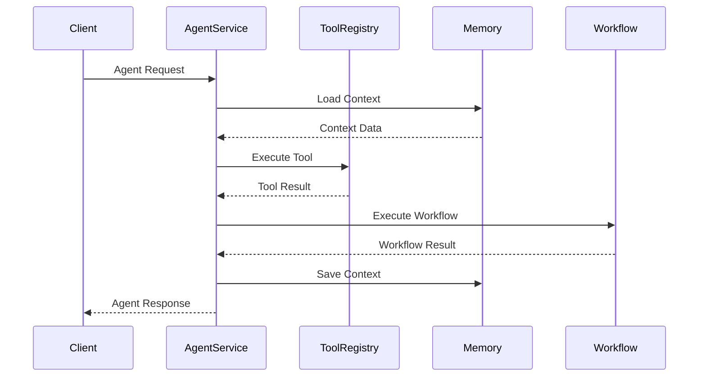

# 核心组件详解

本章详细解析 AgentX 平台的核心组件，包括设计原理、实现细节和关键特性。

## 组件概览

AgentX 的核心组件按照功能划分为五大模块：

1. **智能体服务**：AI Agent 的生命周期管理和请求处理
2. **工作流编排引擎**：复杂业务流程的编排和执行
3. **工具管理系统**：工具的注册、发现、执行和管理
4. **记忆存储系统**：短期和长期记忆的管理
5. **MCP 服务器**：标准化工具协议实现

## 1. 智能体服务（Agent Service）

### 设计目标
- **统一接口**：提供标准化的 AI Agent 交互接口
- **生命周期管理**：Agent 的创建、执行、销毁全生命周期管理
- **上下文管理**：多轮对话的上下文保持和管理
- **工具集成**：无缝集成工具调用功能

### 核心类

#### AgentController
```java
@RestController
@RequestMapping("/api/v1/agents")
public class AgentController {
    
    @Autowired
    private AgentService agentService;
    
    @PostMapping("/process")
    public AgentResponse processAgentRequest(@RequestBody AgentRequest request) {
        return agentService.process(request);
    }
    
    @GetMapping("/{agentId}/status")
    public AgentStatus getAgentStatus(@PathVariable String agentId) {
        return agentService.getStatus(agentId);
    }
}
```

#### AgentService
```java
@Service
public class AgentService {
    
    @Autowired
    private ConversationMemory memory;
    
    @Autowired
    private ToolRegistry toolRegistry;
    
    @Autowired
    private ModelProvider modelProvider;
    
    public AgentResponse process(AgentRequest request) {
        // 1. 获取或创建会话上下文
        AgentContext context = getOrCreateContext(request.getSessionId());
        
        // 2. 添加到会话历史
        context.addMessage(request.getMessage());
        
        // 3. 调用 LLM 生成响应（可能包含工具调用）
        AgentResponse response = generateResponse(context);
        
        // 4. 保存会话状态
        memory.saveContext(context);
        
        return response;
    }
}
```

#### AgentContext
```java
public class AgentContext {
    private String sessionId;
    private List<Message> messageHistory;
    private Map<String, Object> variables;
    private LocalDateTime createdAt;
    private LocalDateTime updatedAt;
    
    // 上下文管理方法
    public void addMessage(Message message) { ... }
    public String getContextSummary() { ... }
    public void clearHistory() { ... }
}
```

### 关键特性

#### 会话管理
- **会话标识**：基于 UUID 的会话唯一标识
- **超时机制**：闲置会话自动清理
- **状态持久化**：会话状态自动保存到 Redis
- **恢复能力**：中断会话可从断点恢复

#### 上下文窗口
- **智能截断**：超出窗口时智能保留重要内容
- **摘要生成**：长历史自动生成摘要
- **优先级保留**：用户消息和重要工具结果优先保留
- **动态调整**：根据模型能力动态调整窗口大小

#### 流式响应
- **SSE 支持**：Server-Sent Events 实时流式输出
- **部分响应**：工具调用过程中返回中间结果
- **进度指示**：长时间操作提供进度提示
- **中断支持**：用户可中断正在生成的响应

## 2. 工作流编排引擎（Workflow Orchestrator）

### 设计目标
- **可视化设计**：支持可视化工作流设计
- **复杂逻辑**：条件分支、循环、并行等复杂控制流
- **状态管理**：工作流状态持久化和恢复
- **监控追踪**：完整的执行日志和性能指标

### 核心类

#### WorkflowDefinition
```java
public class WorkflowDefinition {
    private String id;
    private String name;
    private String description;
    private List<WorkflowStep> steps;
    private Map<String, Object> defaultVariables;
    private WorkflowTrigger trigger;
    
    // DSL 定义示例
    public static WorkflowDefinition fromDSL(String dsl) { ... }
}
```

#### WorkflowStep
```java
public abstract class WorkflowStep {
    private String id;
    private String name;
    private StepType type;
    private Map<String, Object> parameters;
    private List<String> nextSteps;
    
    public abstract StepResult execute(WorkflowContext context);
}

// 具体步骤类型
public class AgentStep extends WorkflowStep { ... }
public class ToolStep extends WorkflowStep { ... }
public class ConditionStep extends WorkflowStep { ... }
public class ParallelStep extends WorkflowStep { ... }
```

#### WorkflowExecutor
```java
@Service
public class WorkflowExecutor {
    
    @Autowired
    private WorkflowRepository repository;
    
    @Autowired
    private WorkflowStateStore stateStore;
    
    public WorkflowResult execute(String workflowId, Map<String, Object> inputs) {
        // 1. 加载工作流定义
        WorkflowDefinition definition = repository.findById(workflowId);
        
        // 2. 创建工作流上下文
        WorkflowContext context = new WorkflowContext(definition, inputs);
        
        // 3. 执行工作流
        return executeWorkflow(definition, context);
    }
    
    private WorkflowResult executeWorkflow(WorkflowDefinition definition, 
                                          WorkflowContext context) {
        // 基于 LangGraph 的状态机执行
        StateMachine machine = createStateMachine(definition);
        return machine.execute(context);
    }
}
```

### 关键特性

#### LangGraph 集成
- **状态机模型**：基于状态机的工作流执行
- **可视化调试**：工作流执行过程可视化
- **条件路由**：基于条件的动态路由
- **并行执行**：多步骤并行执行和同步

#### 错误处理
- **重试机制**：失败步骤自动重试
- **错误捕获**：错误捕获和异常处理
- **补偿事务**：失败时的补偿操作
- **超时控制**：步骤执行超时控制

#### 状态管理
- **检查点**：关键步骤设置检查点
- **状态持久化**：工作流状态自动保存
- **恢复能力**：从检查点恢复执行
- **版本控制**：工作流定义版本管理

## 3. 工具管理系统（Tool Management）

### 设计目标
- **统一注册**：统一工具注册和发现机制
- **标准接口**：标准化的工具调用接口
- **权限控制**：工具调用的权限控制
- **使用统计**：工具使用情况统计和分析

### 核心类

#### ToolRegistry
```java
@Service
public class ToolRegistry {
    
    private Map<String, AgentTool> tools = new ConcurrentHashMap<>();
    private Map<String, ToolMetadata> metadata = new ConcurrentHashMap<>();
    
    public void registerTool(AgentTool tool) {
        String name = tool.name();
        tools.put(name, tool);
        metadata.put(name, createMetadata(tool));
    }
    
    public ToolResponse execute(String toolName, ToolRequest request) {
        AgentTool tool = tools.get(toolName);
        if (tool == null) {
            return ToolResponse.error("Tool not found: " + toolName);
        }
        
        // 权限检查
        if (!hasPermission(request.getUserId(), toolName)) {
            return ToolResponse.error("Permission denied");
        }
        
        // 执行工具
        return tool.execute(request);
    }
    
    public List<ToolMetadata> listTools() {
        return new ArrayList<>(metadata.values());
    }
}
```

#### AgentTool 接口
```java
public interface AgentTool {
    
    String name();
    
    String description();
    
    ToolResponse execute(ToolRequest request);
    
    default Map<String, String> getParameters() {
        return Collections.emptyMap();
    }
    
    default String category() {
        return "general";
    }
}
```

#### 内置工具示例

**WeatherTool**
```java
@Component
public class WeatherTool implements AgentTool {
    
    @Override
    public String name() {
        return "get-weather";
    }
    
    @Override
    public ToolResponse execute(ToolRequest request) {
        String city = request.getParameter("city");
        // 调用天气 API
        WeatherData data = weatherService.getWeather(city);
        return ToolResponse.success(data);
    }
}
```

**RiskRuleTool**
```java
@Component
public class RiskRuleTool implements AgentTool {
    
    @Override
    public String name() {
        return "risk-rule-query";
    }
    
    @Override
    public ToolResponse execute(ToolRequest request) {
        String ruleId = request.getParameter("ruleId");
        // 查询风控规则
        RiskRule rule = riskRuleService.findById(ruleId);
        return ToolResponse.success(rule);
    }
}
```

### 关键特性

#### 工具发现
- **自动注册**：Spring Boot 自动注册 @Component 工具
- **元数据管理**：工具元数据自动生成和管理
- **分类组织**：工具按类别组织
- **版本管理**：工具版本管理和兼容性

#### 权限控制
- **细粒度权限**：基于用户、角色、组织的权限控制
- **动态授权**：运行时动态授权检查
- **审计日志**：所有工具调用记录审计日志
- **配额限制**：工具调用频率和配额限制

#### 性能优化
- **连接池**：外部服务连接池管理
- **缓存策略**：工具结果缓存
- **批量处理**：支持批量工具调用
- **异步执行**：耗时工具异步执行

## 4. 记忆存储系统（Memory System）

### 设计目标
- **分层存储**：短期记忆和长期记忆分层存储
- **智能检索**：基于语义的智能记忆检索
- **记忆压缩**：记忆内容的智能压缩和摘要
- **隐私保护**：敏感记忆内容的隐私保护

### 核心类

#### ConversationMemory
```java
@Service
public class ConversationMemory {
    
    @Autowired
    private RedisTemplate<String, Object> redisTemplate;
    
    @Autowired
    private VectorStore vectorStore;
    
    public void saveMessage(String sessionId, Message message) {
        // 保存到 Redis（短期记忆）
        String key = "session:" + sessionId + ":messages";
        redisTemplate.opsForList().rightPush(key, message);
        
        // 保存到向量存储（长期记忆）
        if (shouldSaveToLongTerm(message)) {
            saveToVectorStore(sessionId, message);
        }
    }
    
    public List<Message> getRecentMessages(String sessionId, int limit) {
        String key = "session:" + sessionId + ":messages";
        long size = redisTemplate.opsForList().size(key);
        long start = Math.max(0, size - limit);
        return redisTemplate.opsForList().range(key, start, size - 1);
    }
}
```

#### VectorStore
```java
@Service
public class VectorStore {
    
    @Autowired
    private MilvusClient milvusClient;
    
    public void storeMemory(String collection, Memory memory) {
        // 生成向量
        float[] vector = embeddingService.embed(memory.getContent());
        
        // 存储到 Milvus
        InsertParam insertParam = InsertParam.newBuilder()
            .withCollectionName(collection)
            .withFields(Arrays.asList(
                new Field("id", memory.getId()),
                new Field("content", memory.getContent()),
                new Field("vector", vector),
                new Field("metadata", memory.getMetadata())
            ))
            .build();
        
        milvusClient.insert(insertParam);
    }
    
    public List<Memory> searchSimilar(String collection, String query, int limit) {
        // 生成查询向量
        float[] queryVector = embeddingService.embed(query);
        
        // 相似性搜索
        SearchParam searchParam = SearchParam.newBuilder()
            .withCollectionName(collection)
            .withVector(queryVector)
            .withTopK(limit)
            .build();
        
        return milvusClient.search(searchParam);
    }
}
```

### 关键特性

#### 短期记忆（Redis）
- **会话存储**：当前会话的完整历史
- **快速访问**：毫秒级访问速度
- **自动清理**：过期会话自动清理
- **内存优化**：智能内存管理和压缩

#### 长期记忆（Milvus）
- **语义存储**：基于向量的语义存储
- **相似性检索**：基于语义的相似性检索
- **混合检索**：向量+关键词混合检索
- **增量更新**：记忆的增量更新和优化

#### 记忆管理
- **重要性评估**：记忆内容重要性自动评估
- **摘要生成**：长记忆内容自动生成摘要
- **关联记忆**：相关记忆自动关联
- **遗忘机制**：不重要记忆自动遗忘

## 5. MCP 服务器（MCP Server）

### 设计目标
- **协议兼容**：完全兼容 MCP 协议标准
- **工具互通**：实现工具生态互通
- **标准化接口**：提供标准化工具调用接口
- **扩展性**：支持多种工具实现方式

### 核心类

#### McpServer
```java
@Service
public class McpServer {
    
    @Autowired
    private ToolRegistry toolRegistry;
    
    @PostMapping("/mcp/tools")
    public McpResponse handleRequest(@RequestBody McpRequest request) {
        switch (request.getMethod()) {
            case "LIST_TOOLS":
                return listTools();
            case "GET_TOOL":
                return getTool(request.getParams());
            case "EXECUTE":
                return executeTool(request.getParams());
            case "PING":
                return ping();
            default:
                return McpResponse.error("Unsupported method");
        }
    }
    
    private McpResponse listTools() {
        List<ToolMetadata> tools = toolRegistry.listTools();
        return McpResponse.success(tools.stream()
            .map(this::toMcpTool)
            .collect(Collectors.toList()));
    }
    
    private McpResponse executeTool(Map<String, Object> params) {
        String toolName = (String) params.get("tool");
        ToolRequest request = new ToolRequest(params);
        ToolResponse response = toolRegistry.execute(toolName, request);
        return toMcpResponse(response);
    }
}
```

#### McpTool
```java
public class McpTool {
    private String name;
    private String description;
    private Map<String, McpParameter> parameters;
    private String category;
    
    // MCP 协议标准字段
    private String schemaVersion = "1.0.0";
    private List<String> capabilities = Arrays.asList("execute", "list");
}
```

### 关键特性

#### 协议支持
- **完整实现**：完整实现 MCP 协议规范
- **版本兼容**：支持多版本协议兼容
- **扩展支持**：支持协议扩展功能
- **错误处理**：标准的错误响应格式

#### 工具互通
- **自动转换**：内置工具自动转换为 MCP 工具
- **外部集成**：集成外部 MCP 工具服务器
- **协议桥接**：不同协议间的桥接转换
- **生态接入**：接入 MCP 工具生态

#### 性能优化
- **连接池**：MCP 连接池管理
- **批量处理**：支持批量工具调用
- **缓存优化**：工具元数据缓存
- **异步处理**：异步工具执行

## 组件交互模式

### 事件驱动架构


### 数据流架构
1. **请求接收**：客户端请求通过 API Gateway 接收
2. **身份验证**：JWT 令牌验证和权限检查
3. **路由分发**：根据请求类型路由到相应服务
4. **业务处理**：核心组件处理业务逻辑
5. **数据存储**：处理结果存储到相应存储
6. **响应返回**：处理结果返回给客户端

## 性能优化策略

### 组件级优化
- **连接复用**：数据库、Redis、外部 API 连接复用
- **缓存策略**：多级缓存策略减少 IO
- **异步处理**：非阻塞异步处理提升并发
- **批处理**：批量操作减少网络往返

### 系统级优化
- **水平扩展**：无状态组件水平扩展
- **垂直扩展**：有状态组件垂直扩展
- **负载均衡**：智能负载均衡策略
- **服务降级**：故障时优雅降级

## 监控和诊断

### 健康指标
- **组件健康**：每个组件的健康状态
- **性能指标**：响应时间、吞吐量、错误率
- **资源使用**：CPU、内存、磁盘、网络
- **业务指标**：用户数、会话数、工具调用数

### 诊断工具
- **日志追踪**：分布式请求追踪
- **性能剖析**：组件性能剖析
- **内存分析**：内存使用分析
- **线程分析**：线程状态分析

## 下一步

了解核心组件后，建议：

- **深入代码**：查看实际代码实现
- **实践开发**：尝试开发自定义组件
- **性能测试**：进行组件性能测试
- **监控配置**：配置组件监控和告警