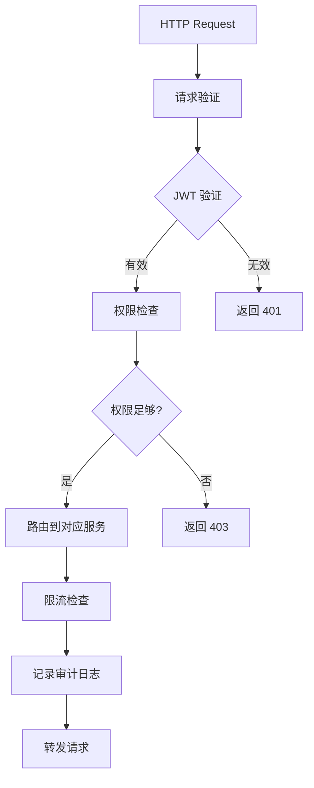
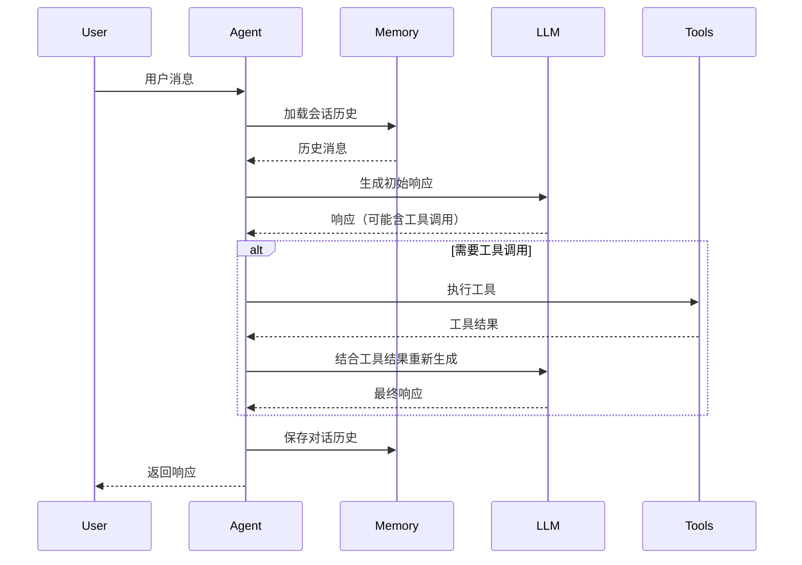
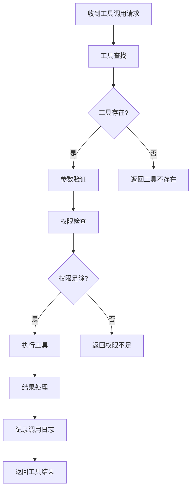
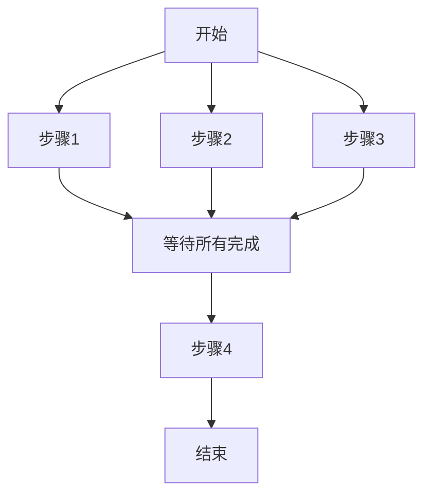
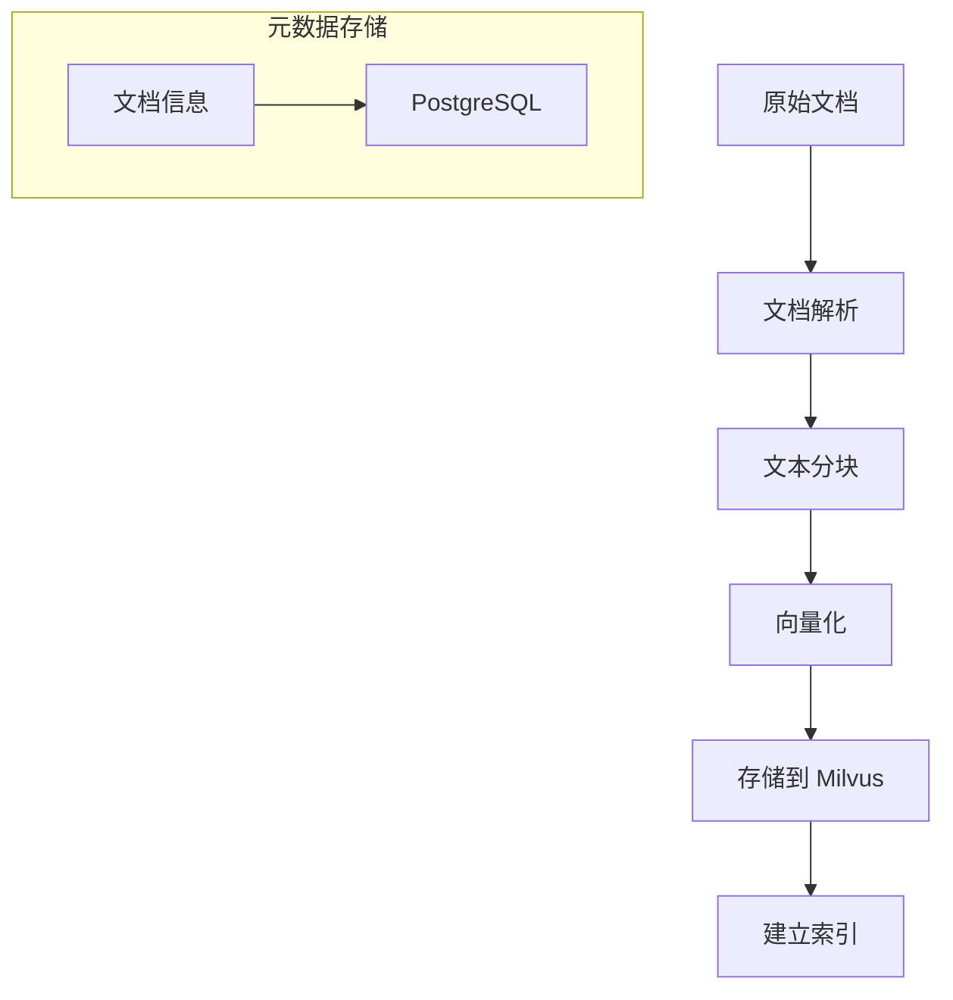

# 数据流与工作流

本章详细说明 AgentX 平台的数据处理流程和工作流执行机制，涵盖从请求接收到结果返回的完整生命周期。

## 数据处理总览

AgentX 的数据处理遵循分层架构，数据在不同层间流动和转换：

```
┌─────────────┐    ┌─────────────┐    ┌─────────────┐    ┌─────────────┐
│  原始请求   │───▶│  请求解析   │───▶│  业务处理   │───▶│  结果返回   │
│  Raw Request│    │  Parsing    │    │  Processing │    │  Response   │
└─────────────┘    └─────────────┘    └─────────────┘    └─────────────┘
        │                   │                   │                  │
        ▼                   ▼                   ▼                  ▼
┌─────────────┐    ┌─────────────┐    ┌─────────────┐    ┌─────────────┐
│  客户端     │    │  API网关    │    │  核心服务   │    │  数据存储   │
│  Client     │    │  Gateway    │    │  Core       │    │  Storage    │
└─────────────┘    └─────────────┘    └─────────────┘    └─────────────┘
```

## 请求处理流程

### 1. 请求接收阶段

#### 客户端请求
```json
{
  "message": "查询北京的天气",
  "agentType": "general",
  "sessionId": "session-123456",
  "parameters": {
    "temperatureUnit": "celsius"
  }
}
```

#### API 网关处理


### 2. 智能体服务处理

#### 会话上下文管理
```java
// 获取或创建会话上下文
public AgentContext getOrCreateContext(String sessionId) {
    // 1. 尝试从 Redis 获取现有会话
    AgentContext context = memory.getContext(sessionId);
    
    if (context == null) {
        // 2. 创建新会话
        context = new AgentContext(sessionId);
        
        // 3. 初始化默认变量
        context.setVariable("temperatureUnit", "celsius");
        context.setVariable("language", "zh-CN");
        
        // 4. 保存到内存
        memory.saveContext(context);
    }
    
    return context;
}
```

#### 消息处理流程


### 3. 工具调用流程

#### 工具执行序列


#### 工具调用示例
```json
// 工具调用请求
{
  "toolName": "get-weather",
  "parameters": {
    "city": "北京",
    "unit": "celsius"
  },
  "metadata": {
    "requestId": "req-123",
    "userId": "user-456",
    "timestamp": "2026-04-13T09:01:00Z"
  }
}

// 工具调用响应
{
  "success": true,
  "data": {
    "city": "北京",
    "temperature": 25,
    "condition": "晴朗",
    "humidity": "60%",
    "wind": "东南风 3级"
  },
  "metadata": {
    "executionTime": 120,
    "toolVersion": "1.0.0"
  }
}
```

## 工作流执行机制

### 工作流定义

#### DSL 示例
```yaml
name: "风控审批流程"
version: "1.0"
description: "自动化风控审批工作流"

variables:
  - name: "applicantId"
    type: "string"
    required: true
  - name: "loanAmount"
    type: "number"
    required: true

steps:
  - id: "step-1"
    type: "tool"
    name: "身份验证"
    tool: "identity-verification"
    parameters:
      applicantId: "{{applicantId}}"
    next: "step-2"
    
  - id: "step-2"
    type: "tool"
    name: "信用评分查询"
    tool: "credit-score-query"
    parameters:
      applicantId: "{{applicantId}}"
    next: "step-3"
    
  - id: "step-3"
    type: "condition"
    name: "风险等级判断"
    condition: "{{creditScore}} >= 600"
    trueNext: "step-4"
    falseNext: "step-5"
    
  - id: "step-4"
    type: "agent"
    name: "自动审批"
    agent: "risk-agent"
    parameters:
      applicantId: "{{applicantId}}"
      loanAmount: "{{loanAmount}}"
    next: "end"
    
  - id: "step-5"
    type: "agent"
    name: "人工复核"
    agent: "human-review-agent"
    parameters:
      applicantId: "{{applicantId}}"
      loanAmount: "{{loanAmount}}"
    next: "end"
```

### 工作流执行引擎

#### 状态机设计
```java
public class WorkflowStateMachine {
    
    private WorkflowDefinition definition;
    private WorkflowContext context;
    private Map<String, WorkflowStep> steps;
    private WorkflowState currentState;
    
    public WorkflowResult execute() {
        // 初始化状态
        currentState = WorkflowState.RUNNING;
        
        // 执行入口步骤
        String currentStepId = definition.getStartStepId();
        
        while (currentState == WorkflowState.RUNNING) {
            WorkflowStep step = steps.get(currentStepId);
            
            // 执行步骤
            StepResult result = step.execute(context);
            
            // 处理结果
            if (result.isSuccess()) {
                // 确定下一步
                currentStepId = determineNextStep(step, result);
                
                // 检查是否结束
                if (currentStepId == null || currentStepId.equals("end")) {
                    currentState = WorkflowState.COMPLETED;
                }
            } else {
                // 处理失败
                handleStepFailure(step, result);
            }
            
            // 保存状态检查点
            saveCheckpoint();
        }
        
        return buildResult();
    }
}
```

#### 并行执行支持


### 错误处理和重试

#### 重试策略
```java
public class RetryPolicy {
    
    private int maxRetries = 3;
    private long initialDelay = 1000; // 1秒
    private double multiplier = 2.0; // 指数退避
    private long maxDelay = 10000; // 10秒
    
    public <T> T executeWithRetry(Callable<T> task) {
        int attempt = 0;
        long delay = initialDelay;
        
        while (attempt <= maxRetries) {
            try {
                return task.call();
            } catch (Exception e) {
                attempt++;
                
                if (attempt > maxRetries) {
                    throw new RuntimeException("Max retries exceeded", e);
                }
                
                // 计算下次重试延迟
                delay = calculateDelay(attempt, delay);
                
                // 等待后重试
                try {
                    Thread.sleep(delay);
                } catch (InterruptedException ie) {
                    Thread.currentThread().interrupt();
                    throw new RuntimeException("Retry interrupted", ie);
                }
            }
        }
        
        throw new RuntimeException("Should not reach here");
    }
}
```

#### 错误类型处理
| 错误类型 | 处理策略 | 重试次数 |
|---------|---------|---------|
| **网络超时** | 指数退避重试 | 3次 |
| **服务不可用** | 短暂等待后重试 | 2次 |
| **数据验证错误** | 立即失败，不重试 | 0次 |
| **权限错误** | 立即失败，不重试 | 0次 |
| **系统错误** | 记录日志，人工干预 | 1次 |

## 数据存储和检索

### 向量检索流程

#### 文档索引


#### 相似性检索
```java
public List<Document> searchSimilar(String query, int limit) {
    // 1. 生成查询向量
    float[] queryVector = embeddingService.embed(query);
    
    // 2. Milvus 相似性搜索
    SearchResult searchResult = milvusClient.search(
        SearchParam.newBuilder()
            .withCollectionName("documents")
            .withVector(queryVector)
            .withTopK(limit)
            .build()
    );
    
    // 3. 获取文档详情
    List<String> documentIds = extractDocumentIds(searchResult);
    return documentService.findByIds(documentIds);
}
```

### 会话记忆管理

#### 记忆层次结构
```
会话记忆
├── 短期记忆 (Redis)
│   ├── 当前对话历史
│   ├── 会话变量
│   └── 临时数据
└── 长期记忆 (Milvus)
    ├── 重要对话摘要
    ├── 学习到的知识
    └── 用户偏好
```

#### 记忆检索策略
```java
public List<Memory> retrieveRelevantMemories(String sessionId, String query) {
    List<Memory> memories = new ArrayList<>();
    
    // 1. 从短期记忆获取最近对话
    List<Message> recentMessages = memoryService.getRecentMessages(sessionId, 10);
    memories.addAll(convertToMemories(recentMessages));
    
    // 2. 从长期记忆获取相关记忆
    List<Memory> longTermMemories = vectorStore.searchSimilar(
        "memories_" + sessionId, query, 5);
    memories.addAll(longTermMemories);
    
    // 3. 按相关性排序
    return memories.stream()
        .sorted(Comparator.comparing(Memory::getRelevanceScore).reversed())
        .collect(Collectors.toList());
}
```

## 性能优化

### 缓存策略

#### 多级缓存设计
```java
public class MultiLevelCache {
    
    @Autowired
    private Cache localCache; // Caffeine 本地缓存
    
    @Autowired
    private RedisTemplate<String, Object> redisCache; // Redis 分布式缓存
    
    public <T> T get(String key, Class<T> type, Supplier<T> loader) {
        // 1. 检查本地缓存
        T value = localCache.getIfPresent(key);
        if (value != null) {
            return value;
        }
        
        // 2. 检查 Redis 缓存
        value = (T) redisCache.opsForValue().get(key);
        if (value != null) {
            // 回填本地缓存
            localCache.put(key, value);
            return value;
        }
        
        // 3. 从数据源加载
        value = loader.get();
        
        // 4. 更新缓存
        if (value != null) {
            localCache.put(key, value);
            redisCache.opsForValue().set(key, value, 1, TimeUnit.HOURS);
        }
        
        return value;
    }
}
```

#### 缓存失效策略
| 数据类型 | 缓存时间 | 失效策略 |
|---------|---------|---------|
| **工具结果** | 5分钟 | 时间过期 |
| **用户会话** | 30分钟 | 访问续期 |
| **静态配置** | 24小时 | 手动刷新 |
| **向量索引** | 不缓存 | 实时查询 |

### 异步处理

#### 异步工具调用
```java
@Async
public CompletableFuture<ToolResponse> executeToolAsync(String toolName, 
                                                       ToolRequest request) {
    return CompletableFuture.supplyAsync(() -> {
        // 执行工具
        ToolResponse response = toolRegistry.execute(toolName, request);
        
        // 记录执行指标
        metricsService.recordToolExecution(toolName, response);
        
        return response;
    }, toolExecutor);
}
```

#### 事件驱动架构
```java
@Component
public class EventPublisher {
    
    @Autowired
    private ApplicationEventPublisher eventPublisher;
    
    public void publishToolExecuted(String toolName, ToolRequest request, 
                                   ToolResponse response) {
        ToolExecutedEvent event = new ToolExecutedEvent(
            toolName, request, response, System.currentTimeMillis());
        
        eventPublisher.publishEvent(event);
    }
}

@Component
public class ToolExecutionListener {
    
    @EventListener
    public void handleToolExecuted(ToolExecutedEvent event) {
        // 更新工具使用统计
        statisticsService.updateToolUsage(event.getToolName());
        
        // 记录审计日志
        auditService.logToolExecution(event);
        
        // 发送监控指标
        metricsService.sendToolMetrics(event);
    }
}
```

## 监控和诊断

### 关键性能指标

#### 请求处理指标
```prometheus
# 请求延迟分布
agentx_request_duration_seconds_bucket{type="agent",le="0.1"} 100
agentx_request_duration_seconds_bucket{type="agent",le="0.5"} 500
agentx_request_duration_seconds_bucket{type="agent",le="1.0"} 800

# 请求成功率
agentx_request_success_rate{type="agent"} 0.98

# 并发请求数
agentx_concurrent_requests{type="agent"} 150
```

#### 工具调用指标
```prometheus
# 工具调用次数
agentx_tool_calls_total{tool="get-weather"} 1200
agentx_tool_calls_total{tool="risk-rule-query"} 850

# 工具调用成功率
agentx_tool_success_rate{tool="get-weather"} 0.99
agentx_tool_success_rate{tool="risk-rule-query"} 0.95

# 工具调用延迟
agentx_tool_duration_seconds{tool="get-weather"} 0.12
agentx_tool_duration_seconds{tool="risk-rule-query"} 0.25
```

### 分布式追踪

#### 请求追踪示例
```json
{
  "traceId": "trace-1234567890",
  "spanId": "span-abcdef",
  "parentSpanId": "span-parent",
  "operation": "AgentRequest",
  "startTime": "2026-04-13T09:01:00.123Z",
  "duration": 1250,
  "tags": {
    "sessionId": "session-123",
    "agentType": "general",
    "userId": "user-456"
  },
  "spans": [
    {
      "spanId": "span-1",
      "operation": "LoadContext",
      "duration": 50,
      "service": "MemoryService"
    },
    {
      "spanId": "span-2",
      "operation": "LLMGeneration",
      "duration": 800,
      "service": "ModelService"
    },
    {
      "spanId": "span-3",
      "operation": "ToolExecution",
      "duration": 350,
      "service": "ToolService",
      "tags": {
        "toolName": "get-weather"
      }
    }
  ]
}
```

## 故障排查指南

### 常见问题诊断

#### 请求超时
1. **检查网络连接**：确认客户端到服务器的网络连通性
2. **检查服务状态**：确认 AgentX 服务正常运行
3. **检查依赖服务**：确认 Redis、Milvus 等依赖服务正常
4. **检查资源使用**：确认 CPU、内存、磁盘资源充足

#### 工具调用失败
1. **检查工具配置**：确认工具参数配置正确
2. **检查权限设置**：确认用户有调用工具的权限
3. **检查外部服务**：确认外部 API 服务可用
4. **检查网络访问**：确认可以访问外部服务

#### 记忆检索问题
1. **检查向量存储**：确认 Milvus 服务正常运行
2. **检查索引状态**：确认向量索引已正确建立
3. **检查嵌入模型**：确认嵌入模型正常工作
4. **检查数据质量**：确认存储的数据格式正确

### 诊断命令

#### 服务健康检查
```bash
# 检查应用健康
curl http://localhost:8080/actuator/health

# 检查 Redis 连接
redis-cli ping

# 检查 Milvus 连接
curl http://localhost:19530/health

# 检查数据库连接
psql -h localhost -U postgres -c "SELECT 1"
```

#### 性能诊断
```bash
# 查看 JVM 状态
jcmd <pid> VM.version
jcmd <pid> VM.system_properties

# 查看线程状态
jstack <pid>

# 查看内存使用
jmap -heap <pid>

# 查看 GC 状态
jstat -gc <pid> 1000 10
```

## 最佳实践

### 数据流优化
1. **减少网络往返**：批量处理请求，减少网络调用
2. **合理使用缓存**：根据数据特性设置合适的缓存策略
3. **异步处理**：耗时操作使用异步处理，不阻塞主流程
4. **连接复用**：复用数据库和外部服务连接

### 工作流设计
1. **明确边界**：每个步骤职责单一明确
2. **错误处理**：为每个步骤设计合适的错误处理策略
3. **状态管理**：合理设计检查点，支持故障恢复
4. **监控指标**：为关键步骤设计监控指标

### 性能调优
1. **基准测试**：建立性能基准，定期测试对比
2. **瓶颈分析**：识别系统瓶颈，针对性优化
3. **容量规划**：基于业务增长预测进行容量规划
4. **负载测试**：定期进行负载测试，验证系统容量

## 下一步

了解数据流和工作流后，建议：

- **实际测试**：运行示例工作流，观察数据流动
- **性能分析**：使用监控工具分析系统性能
- **故障演练**：模拟故障场景，测试系统容错能力
- **优化实践**：根据最佳实践优化现有实现