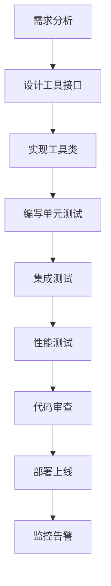

# 添加新工具

本章详细说明如何在 AgentX 平台中添加新的工具，包括工具接口、开发步骤、测试方法和最佳实践。

## 工具系统概述

### 工具概念
在 AgentX 中，工具是 Agent 可以调用的外部功能模块，用于连接 AI 模型和现实世界。工具可以是：
- **信息查询**：天气、股票、新闻等
- **文档处理**：PDF 解析、文本提取等
- **业务操作**：风控规则查询、财务计算等
- **系统交互**：文件操作、数据库查询等

### 工具生命周期
```
工具开发 → 工具注册 → 工具发现 → 工具调用 → 结果返回
    │           │           │           │          │
    ▼           ▼           ▼           ▼          ▼
代码实现 → 自动注册 → 元数据生成 → 权限检查 → 格式转换
```

## 工具开发基础

### AgentTool 接口

所有工具必须实现 `AgentTool` 接口：

```java
package com.agentx.core.tool;

public interface AgentTool {
    
    /**
     * 工具名称（必须唯一）
     */
    String name();
    
    /**
     * 工具描述（用于 AI 模型理解工具功能）
     */
    String description();
    
    /**
     * 执行工具
     * @param request 工具请求
     * @return 工具响应
     */
    ToolResponse execute(ToolRequest request);
    
    /**
     * 获取参数定义（可选）
     * @return 参数名称 -> 参数描述
     */
    default Map<String, String> getParameters() {
        return Collections.emptyMap();
    }
    
    /**
     * 工具分类（可选）
     * @return 分类名称
     */
    default String category() {
        return "general";
    }
    
    /**
     * 是否需要权限验证（可选）
     */
    default boolean requiresAuth() {
        return false;
    }
    
    /**
     * 工具版本（可选）
     */
    default String version() {
        return "1.0.0";
    }
}
```

### 相关类定义

#### ToolRequest
```java
public class ToolRequest {
    private String toolName;
    private Map<String, Object> parameters;
    private Map<String, String> metadata;
    
    // 构造器、Getter、Setter
}
```

#### ToolResponse
```java
public class ToolResponse {
    private boolean success;
    private String message;
    private Object data;
    private String error;
    private LocalDateTime timestamp;
    
    // 静态工厂方法
    public static ToolResponse success(Object data) { ... }
    public static ToolResponse error(String error) { ... }
}
```

## 工具开发步骤

### 步骤 1：创建工具类

#### 基本模板
```java
package com.agentx.tools.example;

import com.agentx.core.tool.*;
import org.springframework.stereotype.Component;

@Component
public class ExampleTool implements AgentTool {
    
    @Override
    public String name() {
        return "example-tool";
    }
    
    @Override
    public String description() {
        return "这是一个示例工具，用于演示工具开发流程";
    }
    
    @Override
    public ToolResponse execute(ToolRequest request) {
        try {
            // 1. 参数验证
            String param = (String) request.getParameters().get("param");
            if (param == null || param.isEmpty()) {
                return ToolResponse.error("参数 param 不能为空");
            }
            
            // 2. 执行业务逻辑
            String result = process(param);
            
            // 3. 返回结果
            return ToolResponse.success(result);
            
        } catch (Exception e) {
            // 4. 错误处理
            return ToolResponse.error("工具执行失败: " + e.getMessage());
        }
    }
    
    @Override
    public Map<String, String> getParameters() {
        return Map.of(
            "param", "示例参数，字符串类型"
        );
    }
    
    @Override
    public String category() {
        return "example";
    }
    
    private String process(String param) {
        // 实际的业务逻辑
        return "处理结果: " + param.toUpperCase();
    }
}
```

### 步骤 2：添加依赖注入

#### 服务注入
```java
@Component
public class WeatherTool implements AgentTool {
    
    private final WeatherService weatherService;
    private final CacheManager cacheManager;
    
    // 通过构造器注入依赖
    public WeatherTool(WeatherService weatherService, 
                      CacheManager cacheManager) {
        this.weatherService = weatherService;
        this.cacheManager = cacheManager;
    }
    
    @Override
    public ToolResponse execute(ToolRequest request) {
        // 使用注入的服务
        String city = (String) request.getParameters().get("city");
        WeatherData data = weatherService.getWeather(city);
        
        // 使用缓存
        cacheManager.put("weather:" + city, data, 300); // 缓存5分钟
        
        return ToolResponse.success(data);
    }
}
```

### 步骤 3：配置工具属性

#### 使用 @Value 注入配置
```java
@Component
public class ApiBasedTool implements AgentTool {
    
    @Value("${tools.api.timeout:10000}")
    private int timeout;
    
    @Value("${tools.api.max-retries:3}")
    private int maxRetries;
    
    @Value("${tools.api.base-url}")
    private String baseUrl;
    
    @Override
    public ToolResponse execute(ToolRequest request) {
        // 使用配置参数
        HttpClient client = HttpClient.newBuilder()
            .connectTimeout(Duration.ofMillis(timeout))
            .build();
        
        // ... 业务逻辑
    }
}
```

#### 配置文件
```yaml
# application.yml
tools:
  api:
    timeout: 10000
    max-retries: 3
    base-url: https://api.example.com
  weather:
    api-key: ${WEATHER_API_KEY}
    cache-ttl: 300
```

### 步骤 4：实现复杂工具

#### 支持多个参数
```java
@Component
public class MultiParamTool implements AgentTool {
    
    @Override
    public Map<String, String> getParameters() {
        return Map.of(
            "param1", "第一个参数，字符串类型，必填",
            "param2", "第二个参数，整数类型，可选",
            "param3", "第三个参数，布尔类型，默认 true"
        );
    }
    
    @Override
    public ToolResponse execute(ToolRequest request) {
        Map<String, Object> params = request.getParameters();
        
        // 获取必填参数
        String param1 = getRequiredParam(params, "param1", String.class);
        
        // 获取可选参数（带默认值）
        Integer param2 = getOptionalParam(params, "param2", Integer.class, 0);
        Boolean param3 = getOptionalParam(params, "param3", Boolean.class, true);
        
        // 业务逻辑
        return ToolResponse.success(process(param1, param2, param3));
    }
    
    private <T> T getRequiredParam(Map<String, Object> params, 
                                  String key, Class<T> type) {
        Object value = params.get(key);
        if (value == null) {
            throw new IllegalArgumentException("缺少必要参数: " + key);
        }
        return type.cast(value);
    }
    
    private <T> T getOptionalParam(Map<String, Object> params, 
                                  String key, Class<T> type, T defaultValue) {
        Object value = params.get(key);
        return value != null ? type.cast(value) : defaultValue;
    }
}
```

## 工具开发示例

### 示例 1：天气查询工具

```java
package com.agentx.tools.weather;

import com.agentx.core.tool.*;
import org.springframework.beans.factory.annotation.Value;
import org.springframework.stereotype.Component;
import org.springframework.web.client.RestTemplate;

import java.util.Map;

@Component
public class WeatherTool implements AgentTool {
    
    private final RestTemplate restTemplate;
    
    @Value("${tools.weather.api-key}")
    private String apiKey;
    
    @Value("${tools.weather.api-url:https://api.weatherapi.com/v1/current.json}")
    private String apiUrl;
    
    public WeatherTool(RestTemplate restTemplate) {
        this.restTemplate = restTemplate;
    }
    
    @Override
    public String name() {
        return "get-weather";
    }
    
    @Override
    public String description() {
        return "查询指定城市的当前天气信息，包括温度、天气状况、湿度、风速等";
    }
    
    @Override
    public Map<String, String> getParameters() {
        return Map.of(
            "city", "城市名称，如：北京、上海、纽约（必填）",
            "unit", "温度单位，celsius（摄氏度）或 fahrenheit（华氏度），默认 celsius"
        );
    }
    
    @Override
    public String category() {
        return "weather";
    }
    
    @Override
    public ToolResponse execute(ToolRequest request) {
        try {
            // 参数验证
            String city = getRequiredParam(request, "city", String.class);
            String unit = getOptionalParam(request, "unit", String.class, "celsius");
            
            // 构建请求
            String url = String.format("%s?key=%s&q=%s", apiUrl, apiKey, city);
            
            // 调用外部 API
            WeatherApiResponse response = restTemplate.getForObject(url, WeatherApiResponse.class);
            
            if (response == null) {
                return ToolResponse.error("天气 API 返回空响应");
            }
            
            // 转换响应格式
            WeatherResult result = convertResponse(response, unit);
            
            return ToolResponse.success(result);
            
        } catch (IllegalArgumentException e) {
            return ToolResponse.error("参数错误: " + e.getMessage());
        } catch (Exception e) {
            return ToolResponse.error("天气查询失败: " + e.getMessage());
        }
    }
    
    private WeatherResult convertResponse(WeatherApiResponse apiResponse, String unit) {
        WeatherResult result = new WeatherResult();
        result.setCity(apiResponse.getLocation().getName());
        result.setCountry(apiResponse.getLocation().getCountry());
        
        // 温度单位转换
        double tempC = apiResponse.getCurrent().getTempC();
        if ("fahrenheit".equals(unit)) {
            result.setTemperature(tempC * 9/5 + 32);
            result.setUnit("°F");
        } else {
            result.setTemperature(tempC);
            result.setUnit("°C");
        }
        
        result.setCondition(apiResponse.getCurrent().getCondition().getText());
        result.setHumidity(apiResponse.getCurrent().getHumidity() + "%");
        result.setWindSpeed(apiResponse.getCurrent().getWindKph() + " km/h");
        result.setWindDirection(apiResponse.getCurrent().getWindDir());
        result.setFeelsLike(apiResponse.getCurrent().getFeelslikeC());
        result.setVisibility(apiResponse.getCurrent().getVisKm() + " km");
        
        return result;
    }
    
    // 内部类定义
    private static class WeatherApiResponse {
        private Location location;
        private Current current;
        
        // Getter、Setter
    }
    
    private static class WeatherResult {
        private String city;
        private String country;
        private double temperature;
        private String unit;
        private String condition;
        private String humidity;
        private String windSpeed;
        private String windDirection;
        private double feelsLike;
        private String visibility;
        
        // Getter、Setter
    }
}
```

### 示例 2：文档解析工具

```java
package com.agentx.tools.document;

import com.agentx.core.tool.*;
import org.apache.tika.Tika;
import org.apache.tika.metadata.Metadata;
import org.springframework.stereotype.Component;

import java.io.File;
import java.io.FileInputStream;
import java.io.InputStream;
import java.nio.file.Files;
import java.nio.file.Path;
import java.util.Map;

@Component
public class DocumentTool implements AgentTool {
    
    private final Tika tika = new Tika();
    
    @Override
    public String name() {
        return "parse-document";
    }
    
    @Override
    public String description() {
        return "解析文档文件，提取文本内容和元数据，支持 PDF、Word、Excel、PPT 等格式";
    }
    
    @Override
    public Map<String, String> getParameters() {
        return Map.of(
            "filePath", "文档文件路径（必填）",
            "extractMetadata", "是否提取元数据，true/false，默认 true",
            "maxLength", "提取文本最大长度，默认 10000 字符"
        );
    }
    
    @Override
    public String category() {
        return "document";
    }
    
    @Override
    public ToolResponse execute(ToolRequest request) {
        try {
            // 参数验证
            String filePath = getRequiredParam(request, "filePath", String.class);
            boolean extractMetadata = getOptionalParam(request, "extractMetadata", Boolean.class, true);
            int maxLength = getOptionalParam(request, "maxLength", Integer.class, 10000);
            
            // 文件验证
            Path path = Path.of(filePath);
            if (!Files.exists(path)) {
                return ToolResponse.error("文件不存在: " + filePath);
            }
            
            if (!Files.isReadable(path)) {
                return ToolResponse.error("文件不可读: " + filePath);
            }
            
            File file = path.toFile();
            
            // 解析文档
            DocumentResult result = new DocumentResult();
            result.setFileName(file.getName());
            result.setFileSize(file.length());
            result.setFileType(detectFileType(file));
            
            // 提取文本内容
            String content = extractText(file, maxLength);
            result.setContent(content);
            result.setContentLength(content.length());
            
            // 提取元数据
            if (extractMetadata) {
                Map<String, String> metadata = extractMetadata(file);
                result.setMetadata(metadata);
            }
            
            return ToolResponse.success(result);
            
        } catch (SecurityException e) {
            return ToolResponse.error("文件访问被拒绝: " + e.getMessage());
        } catch (Exception e) {
            return ToolResponse.error("文档解析失败: " + e.getMessage());
        }
    }
    
    private String detectFileType(File file) throws Exception {
        try (InputStream stream = new FileInputStream(file)) {
            return tika.detect(stream);
        }
    }
    
    private String extractText(File file, int maxLength) throws Exception {
        try (InputStream stream = new FileInputStream(file)) {
            String text = tika.parseToString(stream);
            
            // 截断文本到指定长度
            if (text.length() > maxLength) {
                text = text.substring(0, maxLength) + "...（截断）";
            }
            
            return text;
        }
    }
    
    private Map<String, String> extractMetadata(File file) throws Exception {
        try (InputStream stream = new FileInputStream(file)) {
            Metadata metadata = new Metadata();
            tika.parse(stream, metadata);
            
            Map<String, String> result = new HashMap<>();
            for (String name : metadata.names()) {
                result.put(name, metadata.get(name));
            }
            
            return result;
        }
    }
    
    // 辅助方法：获取必需参数
    private <T> T getRequiredParam(ToolRequest request, String paramName, Class<T> type) {
        Object value = request.getParameters().get(paramName);
        if (value == null) {
            throw new IllegalArgumentException("缺少必要参数: " + paramName);
        }
        return type.cast(value);
    }
    
    // 辅助方法：获取可选参数（带默认值）
    private <T> T getOptionalParam(ToolRequest request, String paramName, Class<T> type, T defaultValue) {
        Object value = request.getParameters().get(paramName);
        return value != null ? type.cast(value) : defaultValue;
    }
}

## 工具注册与发现

### 自动注册机制
AgentX 使用 Spring Boot 的自动配置机制自动注册所有实现 `AgentTool` 接口的 Bean。

#### 配置示例
```java
@Configuration
@EnableAutoConfiguration
public class ToolAutoConfiguration {
    
    @Bean
    public ToolRegistry toolRegistry(List<AgentTool> tools) {
        ToolRegistry registry = new ToolRegistry();
        
        for (AgentTool tool : tools) {
            registry.register(tool);
            log.info("注册工具: {} -> {}", tool.name(), tool.getClass().getSimpleName());
        }
        
        return registry;
    }
}
```

### 手动注册
如果需要动态注册工具（例如从数据库加载），可以使用手动注册：

```java
@Service
public class DynamicToolRegistration {
    
    @Autowired
    private ToolRegistry toolRegistry;
    
    /**
     * 动态注册新工具
     */
    public void registerDynamicTool(AgentTool tool) {
        toolRegistry.register(tool);
        log.info("动态注册工具: {}", tool.name());
    }
    
    /**
     * 卸载工具
     */
    public void unregisterTool(String toolName) {
        toolRegistry.unregister(toolName);
        log.info("卸载工具: {}", toolName);
    }
    
    /**
     * 重新加载所有工具
     */
    public void reloadTools() {
        toolRegistry.clear();
        
        // 从配置源重新加载
        List<AgentTool> tools = loadToolsFromConfig();
        for (AgentTool tool : tools) {
            toolRegistry.register(tool);
        }
        
        log.info("重新加载 {} 个工具", tools.size());
    }
}
```

### 工具发现 API
AgentX 提供 REST API 用于发现可用工具：

```java
@RestController
@RequestMapping("/api/v1/tools")
public class ToolDiscoveryController {
    
    @Autowired
    private ToolRegistry toolRegistry;
    
    @GetMapping
    public List<ToolInfo> listTools() {
        return toolRegistry.listTools().stream()
            .map(this::convertToToolInfo)
            .collect(Collectors.toList());
    }
    
    @GetMapping("/{toolName}")
    public ToolInfo getToolInfo(@PathVariable String toolName) {
        AgentTool tool = toolRegistry.getTool(toolName);
        if (tool == null) {
            throw new NotFoundException("工具不存在: " + toolName);
        }
        return convertToToolInfo(tool);
    }
    
    @GetMapping("/{toolName}/schema")
    public ToolSchema getToolSchema(@PathVariable String toolName) {
        AgentTool tool = toolRegistry.getTool(toolName);
        if (tool == null) {
            throw new NotFoundException("工具不存在: " + toolName);
        }
        
        ToolSchema schema = new ToolSchema();
        schema.setName(tool.name());
        schema.setDescription(tool.description());
        schema.setParameters(tool.getParameters());
        schema.setCategory(tool.category());
        schema.setVersion(tool.version());
        
        return schema;
    }
    
    private ToolInfo convertToToolInfo(AgentTool tool) {
        ToolInfo info = new ToolInfo();
        info.setName(tool.name());
        info.setDescription(tool.description());
        info.setCategory(tool.category());
        info.setVersion(tool.version());
        info.setRequiresAuth(tool.requiresAuth());
        info.setLastUpdated(LocalDateTime.now());
        
        return info;
    }
}
```

## 工具测试

### 单元测试
为工具编写单元测试确保功能正确性：

```java
@SpringBootTest
class WeatherToolTest {
    
    @Autowired
    private WeatherTool weatherTool;
    
    @MockBean
    private RestTemplate restTemplate;
    
    @Test
    void testGetWeather_Success() {
        // 模拟 API 响应
        WeatherApiResponse mockResponse = createMockWeatherResponse();
        when(restTemplate.getForObject(anyString(), eq(WeatherApiResponse.class)))
            .thenReturn(mockResponse);
        
        // 构建请求
        ToolRequest request = new ToolRequest();
        request.setToolName("get-weather");
        request.setParameters(Map.of("city", "北京"));
        
        // 执行工具
        ToolResponse response = weatherTool.execute(request);
        
        // 验证结果
        assertTrue(response.isSuccess());
        assertNotNull(response.getData());
        
        WeatherResult result = (WeatherResult) response.getData();
        assertEquals("北京", result.getCity());
        assertEquals(25.0, result.getTemperature(), 0.1);
    }
    
    @Test
    void testGetWeather_MissingCity() {
        ToolRequest request = new ToolRequest();
        request.setToolName("get-weather");
        request.setParameters(Collections.emptyMap());
        
        ToolResponse response = weatherTool.execute(request);
        
        assertFalse(response.isSuccess());
        assertTrue(response.getError().contains("参数错误"));
    }
    
    @Test
    void testGetWeather_ApiFailure() {
        when(restTemplate.getForObject(anyString(), eq(WeatherApiResponse.class)))
            .thenThrow(new HttpClientErrorException(HttpStatus.INTERNAL_SERVER_ERROR));
        
        ToolRequest request = new ToolRequest();
        request.setToolName("get-weather");
        request.setParameters(Map.of("city", "北京"));
        
        ToolResponse response = weatherTool.execute(request);
        
        assertFalse(response.isSuccess());
        assertTrue(response.getError().contains("天气查询失败"));
    }
}
```

### 集成测试
测试工具在完整 Agent 上下文中的行为：

```java
@SpringBootTest
@AutoConfigureMockMvc
class ToolIntegrationTest {
    
    @Autowired
    private MockMvc mockMvc;
    
    @Test
    void testToolExecutionThroughAgent() throws Exception {
        // 构建 Agent 请求
        String requestBody = """
        {
            "agentType": "general-agent",
            "message": "北京天气怎么样？",
            "sessionId": "test-session-123"
        }
        """;
        
        // 发送请求
        mockMvc.perform(post("/api/v1/agents/process")
                .contentType(MediaType.APPLICATION_JSON)
                .content(requestBody))
            .andExpect(status().isOk())
            .andExpect(jsonPath("$.message").exists())
            .andExpect(jsonPath("$.toolCalls[0].toolName").value("get-weather"))
            .andExpect(jsonPath("$.toolCalls[0].parameters.city").value("北京"));
    }
    
    @Test
    void testToolDiscoveryApi() throws Exception {
        mockMvc.perform(get("/api/v1/tools"))
            .andExpect(status().isOk())
            .andExpect(jsonPath("$[0].name").exists())
            .andExpect(jsonPath("$[0].description").exists())
            .andExpect(jsonPath("$[0].category").exists());
    }
}
```

### 性能测试
确保工具在高负载下的性能表现：

```java
@SpringBootTest
class ToolPerformanceTest {
    
    @Autowired
    private WeatherTool weatherTool;
    
    @Test
    void testConcurrentToolExecution() throws InterruptedException {
        int threadCount = 10;
        int requestsPerThread = 100;
        ExecutorService executor = Executors.newFixedThreadPool(threadCount);
        
        CountDownLatch latch = new CountDownLatch(threadCount * requestsPerThread);
        AtomicInteger successCount = new AtomicInteger(0);
        AtomicInteger failureCount = new AtomicInteger(0);
        
        long startTime = System.currentTimeMillis();
        
        for (int i = 0; i < threadCount; i++) {
            executor.submit(() -> {
                for (int j = 0; j < requestsPerThread; j++) {
                    try {
                        ToolRequest request = new ToolRequest();
                        request.setToolName("get-weather");
                        request.setParameters(Map.of("city", "上海" + j));
                        
                        ToolResponse response = weatherTool.execute(request);
                        
                        if (response.isSuccess()) {
                            successCount.incrementAndGet();
                        } else {
                            failureCount.incrementAndGet();
                        }
                    } catch (Exception e) {
                        failureCount.incrementAndGet();
                    } finally {
                        latch.countDown();
                    }
                }
            });
        }
        
        latch.await(30, TimeUnit.SECONDS);
        long endTime = System.currentTimeMillis();
        
        executor.shutdown();
        
        long totalRequests = threadCount * requestsPerThread;
        long durationMs = endTime - startTime;
        double qps = totalRequests / (durationMs / 1000.0);
        
        log.info("性能测试结果：");
        log.info("总请求数: {}", totalRequests);
        log.info("成功数: {}", successCount.get());
        log.info("失败数: {}", failureCount.get());
        log.info("总耗时: {} ms", durationMs);
        log.info("QPS: {}", qps);
        
        // 断言性能要求
        assertTrue(qps > 50, "QPS 应大于 50");
        assertEquals(totalRequests, successCount.get() + failureCount.get());
    }
}
```

## 工具最佳实践

### 1. 错误处理
- **提供有意义的错误信息**：错误消息应帮助用户理解问题所在
- **区分客户端和服务端错误**：使用不同的错误码或类型
- **支持重试机制**：对于临时性错误，提供重试逻辑

```java
@Override
public ToolResponse execute(ToolRequest request) {
    int maxRetries = 3;
    int retryCount = 0;
    
    while (retryCount < maxRetries) {
        try {
            return doExecute(request);
        } catch (TemporaryException e) {
            retryCount++;
            if (retryCount >= maxRetries) {
                return ToolResponse.error("操作失败，请稍后重试: " + e.getMessage());
            }
            
            // 指数退避
            try {
                Thread.sleep(1000L * (1 << retryCount));
            } catch (InterruptedException ie) {
                Thread.currentThread().interrupt();
                return ToolResponse.error("操作被中断");
            }
        } catch (PermanentException e) {
            return ToolResponse.error("操作失败: " + e.getMessage());
        }
    }
    
    return ToolResponse.error("操作失败，已达到最大重试次数");
}
```

### 2. 安全性
- **输入验证**：对所有输入参数进行严格验证
- **权限检查**：根据用户角色限制工具访问
- **审计日志**：记录所有工具调用

```java
@Component
public class SecureTool implements AgentTool {
    
    @Autowired
    private SecurityContext securityContext;
    
    @Override
    public ToolResponse execute(ToolRequest request) {
        // 1. 权限检查
        if (!hasPermission(request)) {
            auditLog("权限拒绝", request);
            return ToolResponse.error("权限不足");
        }
        
        // 2. 输入验证
        ValidationResult validation = validateInput(request);
        if (!validation.isValid()) {
            auditLog("输入验证失败", request);
            return ToolResponse.error(validation.getErrorMessage());
        }
        
        // 3. 执行操作
        try {
            ToolResponse response = doSecureOperation(request);
            auditLog("操作成功", request);
            return response;
        } catch (Exception e) {
            auditLog("操作失败: " + e.getMessage(), request);
            return ToolResponse.error("安全操作失败");
        }
    }
    
    private boolean hasPermission(ToolRequest request) {
        User user = securityContext.getCurrentUser();
        String toolName = request.getToolName();
        
        return user.getRoles().stream()
            .anyMatch(role -> role.hasPermission(toolName));
    }
    
    private void auditLog(String action, ToolRequest request) {
        AuditLog log = new AuditLog();
        log.setAction(action);
        log.setToolName(request.getToolName());
        log.setUserId(securityContext.getCurrentUser().getId());
        log.setTimestamp(LocalDateTime.now());
        log.setParameters(request.getParameters());
        
        auditService.save(log);
    }
}
```

### 3. 性能优化
- **缓存**：对频繁访问的数据添加缓存
- **批处理**：支持批量操作减少网络开销
- **异步执行**：耗时操作使用异步执行

```java
@Component
public class OptimizedTool implements AgentTool {
    
    @Autowired
    private CacheManager cacheManager;
    
    private final LoadingCache<String, ExpensiveData> cache = CacheBuilder.newBuilder()
        .maximumSize(1000)
        .expireAfterWrite(10, TimeUnit.MINUTES)
        .build(new CacheLoader<String, ExpensiveData>() {
            @Override
            public ExpensiveData load(String key) throws Exception {
                return loadExpensiveData(key);
            }
        });
    
    @Override
    public ToolResponse execute(ToolRequest request) {
        String key = (String) request.getParameters().get("key");
        
        try {
            // 使用缓存
            ExpensiveData data = cache.get(key);
            
            return ToolResponse.success(data);
        } catch (Exception e) {
            return ToolResponse.error("数据加载失败: " + e.getMessage());
        }
    }
    
    // 批量版本
    public ToolResponse executeBatch(ToolRequest request) {
        List<String> keys = (List<String>) request.getParameters().get("keys");
        
        try {
            Map<String, ExpensiveData> results = cache.getAll(keys);
            
            return ToolResponse.success(results);
        } catch (Exception e) {
            return ToolResponse.error("批量数据加载失败: " + e.getMessage());
        }
    }
}
```

### 4. 可观测性
- **指标监控**：收集工具调用次数、成功率、延迟等指标
- **分布式追踪**：集成追踪系统跟踪工具调用链
- **结构化日志**：使用结构化日志便于分析

```java
@Component
public class ObservableTool implements AgentTool {
    
    private final MeterRegistry meterRegistry;
    private final Tracer tracer;
    
    public ObservableTool(MeterRegistry meterRegistry, Tracer tracer) {
        this.meterRegistry = meterRegistry;
        this.tracer = tracer;
    }
    
    @Override
    public ToolResponse execute(ToolRequest request) {
        // 创建追踪 span
        Span span = tracer.buildSpan("tool-execute")
            .withTag("tool.name", name())
            .start();
        
        try (Scope scope = tracer.activateSpan(span)) {
            long startTime = System.currentTimeMillis();
            
            // 记录调用次数
            meterRegistry.counter("tool.calls", "name", name()).increment();
            
            // 执行工具
            ToolResponse response = doExecute(request);
            
            long duration = System.currentTimeMillis() - startTime;
            
            // 记录延迟
            meterRegistry.timer("tool.duration", "name", name())
                .record(duration, TimeUnit.MILLISECONDS);
            
            // 记录成功率
            String status = response.isSuccess() ? "success" : "error";
            meterRegistry.counter("tool.responses", "name", name(), "status", status)
                .increment();
            
            // 添加追踪标签
            span.setTag("success", response.isSuccess());
            span.setTag("duration_ms", duration);
            
            return response;
        } catch (Exception e) {
            // 记录错误
            meterRegistry.counter("tool.errors", "name", name()).increment();
            span.setTag("error", true);
            span.log(e.getMessage());
            
            return ToolResponse.error("工具执行异常: " + e.getMessage());
        } finally {
            span.finish();
        }
    }
}
```

## 工具开发工作流

### 开发流程


### 代码审查清单
1. ✅ 工具名称是否清晰、唯一？
2. ✅ 工具描述是否准确、完整？
3. ✅ 参数定义是否清晰？
4. ✅ 错误处理是否完备？
5. ✅ 是否有安全风险？
6. ✅ 性能是否满足要求？
7. ✅ 测试覆盖率是否达标？
8. ✅ 文档是否完整？

### 部署检查清单
1. **配置检查**
   - 环境变量是否正确设置？
   - 配置文件是否完整？
   - 依赖服务是否可用？

2. **健康检查**
   - 工具是否成功注册？
   - 依赖连接是否正常？
   - 权限配置是否正确？

3. **监控配置**
   - 指标收集是否启用？
   - 告警规则是否设置？
   - 日志收集是否配置？

## 常见问题解答

### Q1: 工具执行超时怎么办？
**A:** 
1. 检查工具实现是否有阻塞操作
2. 增加超时配置：`@Value("${tool.timeout:30000}")`
3. 使用异步执行模式
4. 添加超时监控和告警

### Q2: 如何调试工具调用问题？
**A:**
1. 启用 DEBUG 级别日志
2. 使用分布式追踪查看调用链
3. 检查工具注册状态
4. 验证参数格式和类型
5. 使用测试工具单独调用

### Q3: 工具如何支持版本管理？
**A:**
1. 在工具接口中添加版本号
2. 支持多版本共存
3. 提供版本迁移工具
4. 文档记录版本变化

```java
public interface VersionedAgentTool extends AgentTool {
    
    /**
     * 获取支持的版本列表
     */
    List<String> getSupportedVersions();
    
    /**
     * 根据版本执行工具
     */
    default ToolResponse execute(ToolRequest request, String version) {
        if (!getSupportedVersions().contains(version)) {
            return ToolResponse.error("不支持的版本: " + version);
        }
        
        return execute(request);
    }
}
```

### Q4: 如何扩展工具功能？
**A:**
1. 继承现有工具类
2. 使用装饰器模式
3. 通过配置启用/禁用功能
4. 使用插件机制

```java
@Component
public class EnhancedWeatherTool extends WeatherTool {
    
    @Autowired
    private ForecastService forecastService;
    
    @Override
    public String description() {
        return super.description() + "，并支持未来3天天气预报";
    }
    
    @Override
    public ToolResponse execute(ToolRequest request) {
        // 先执行父类功能
        ToolResponse response = super.execute(request);
        
        if (!response.isSuccess()) {
            return response;
        }
        
        // 增强功能：添加天气预报
        String city = (String) request.getParameters().get("city");
        Forecast forecast = forecastService.get3DayForecast(city);
        
        EnhancedWeatherResult result = new EnhancedWeatherResult();
        result.setCurrent((WeatherResult) response.getData());
        result.setForecast(forecast);
        
        return ToolResponse.success(result);
    }
}
```

## 总结

开发 AgentX 工具是一个系统性的工程，需要综合考虑功能、性能、安全和可观测性。遵循本章的最佳实践，您可以：

1. **快速开发**：使用模板和示例加速开发过程
2. **保证质量**：通过完整的测试覆盖确保工具稳定性
3. **易于维护**：清晰的代码结构和文档降低维护成本
4. **安全可靠**：内置的安全机制保护系统安全
5. **可观测**：完善的监控体系帮助快速定位问题

记住，好的工具不仅仅是功能正确，更是易于理解、使用和维护的。在开发过程中，始终从用户（包括 AI Agent 和最终用户）的角度思考，创建真正有价值的工具。

接下来，您可以参考 [创建工作流](04-creating-workflows.md) 学习如何将多个工具组合成复杂的工作流。