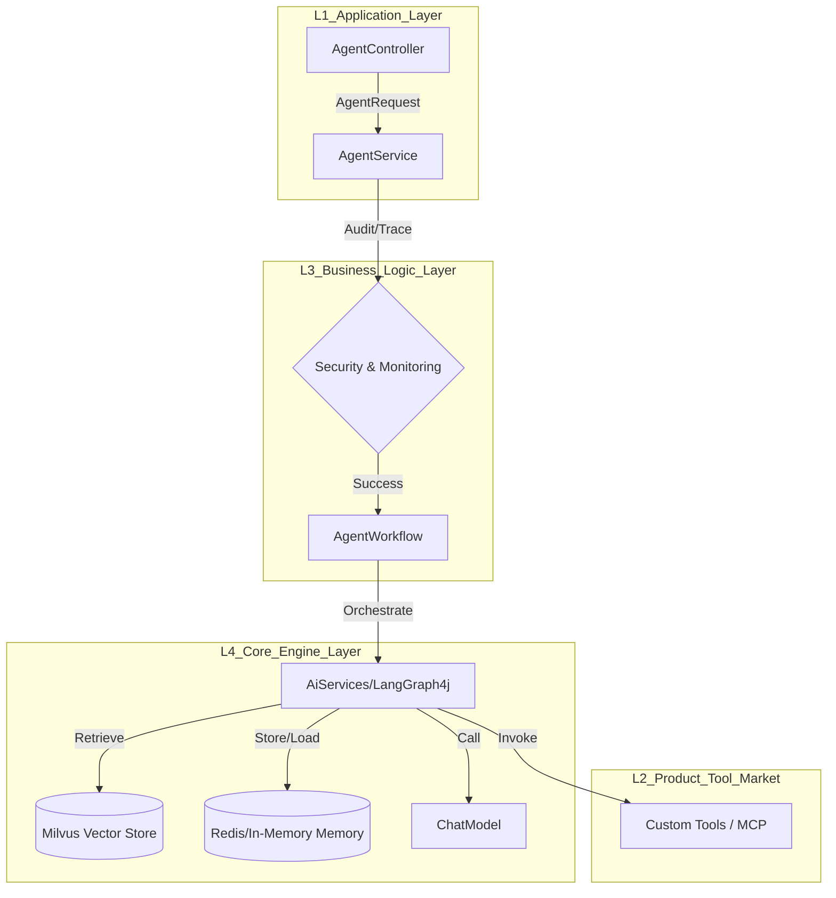
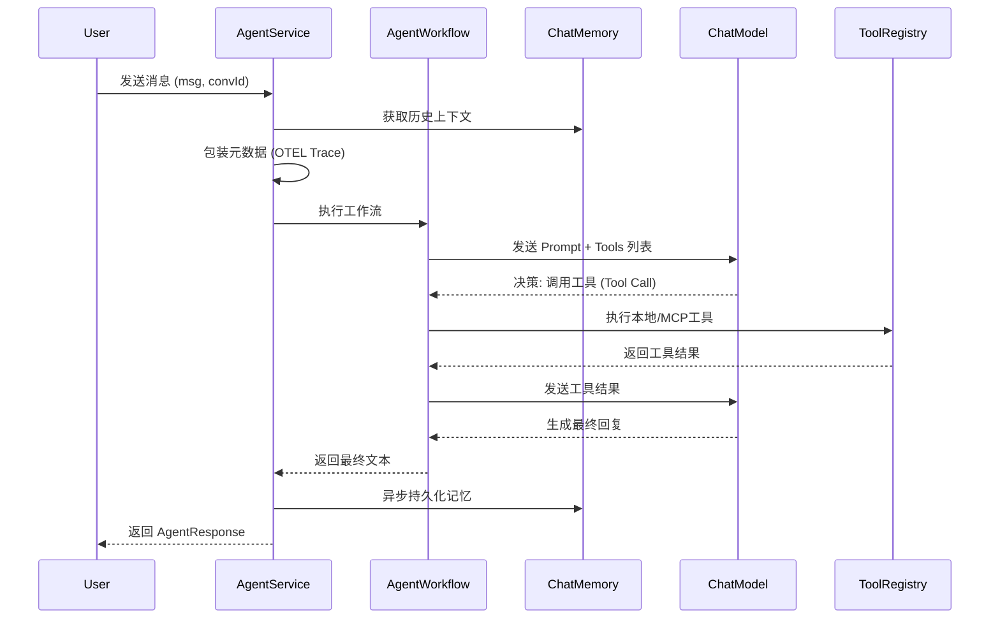

这是一份针对你提供的代码进行的深度优化方案。优化重点在于：**利用 Java 21 虚拟线程特性、解耦手动工具管理、标准化 LangChain4j 的记忆机制，并对齐你之前的“四层架构”设计。**

---

### 一、 优化后的核心架构图 (Architecture Diagram)

根据你的项目需求，AgentX 的逻辑流转如下：



---

### 二、 核心执行流程图 (Sequence Diagram)

展示一个请求从进入到返回的生命周期：



---

### 三、 优化建议与代码实现

#### 1. 优化 ToolRegistry (利用 Spring 自动发现)
**问题：** 原代码手动注册工具太繁琐。
**优化：** 利用 Spring 自动注入所有带 `@Component` 的工具，LangChain4j 自动解析 `@Tool` 注解。

```java
@Component
public class ToolRegistry {
    // 自动注入 Spring 容器中所有的工具类实例
    private final List<Object> toolInstances;

    public ToolRegistry(List<Object> toolInstances) {
        this.toolInstances = toolInstances;
    }

    public List<Object> getAllToolInstances() {
        return toolInstances;
    }
}
```

#### 2. 优化 AgentWorkflow (池化 AiServices)
**问题：** 每次请求都 `builder().build()` 会造成性能开销。
**优化：** 预定义智能体接口，利用 `AiServices` 自动关联。

```java
@AiService
public interface GeneralAssistant {
    // 自动关联 ChatMemoryProvider, Tools 和 ChatModel
    String chat(@MemoryId String memoryId, @UserMessage String message);
}
```

#### 3. 优化 AgentService (核心逻辑精简)
**优化点：** 引入虚拟线程支持，标准化异常处理，使用 `ChatMemoryProvider`。

```java
@Service
@Slf4j
public class AgentService {

    private final GeneralAssistant assistant; // 注入由 AiServices 创建的代理
    private final ConversationMemory conversationMemory;

    public AgentService(GeneralAssistant assistant, ConversationMemory conversationMemory) {
        this.assistant = assistant;
        this.conversationMemory = conversationMemory;
    }

    public AgentResponse process(AgentRequest request) {
        // 使用 Java 21 虚拟线程处理耗时 IO（LLM调用）
        return Thread.ofVirtual().start(() -> {
            String conversationId = Optional.ofNullable(request.getConversationId())
                    .orElse(UUID.randomUUID().toString());

            try {
                // 执行工作流（自动处理了上下文记忆加载、工具探测、LLM调用）
                String responseText = assistant.chat(conversationId, request.getMessage());

                return AgentResponse.success(responseText, conversationId);
            } catch (Exception e) {
                log.error("Agent processing error", e);
                return AgentResponse.error(e.getMessage(), conversationId);
            }
        }).join(); // 实际生产建议异步返回 Flux 或 CompletableFuture
    }

    // 修复原代码中通过 toString 强转消息的脆弱逻辑
    public List<Map<String, Object>> getConversationHistory(String conversationId) {
        return conversationMemory.getMessages(conversationId).stream()
            .map(msg -> {
                Map<String, Object> map = new HashMap<>();
                map.add("type", msg.type().name());
                map.add("text", msg.text()); // LangChain4j 消息对象有标准的 text() 方法
                return map;
            }).collect(Collectors.toList());
    }
}
```

#### 4. 优化 ConversationMemory (对接标准接口)
**优化：** 实现 `ChatMemoryStore`，以便无缝集成到 LangChain4j。

```java
@Component
public class ConversationMemory implements ChatMemoryStore {
    private final Map<Object, List<ChatMessage>> store = new ConcurrentHashMap<>();

    @Override
    public List<ChatMessage> getMessages(Object memoryId) {
        return store.getOrDefault(memoryId, new ArrayList<>());
    }

    @Override
    public void updateMessages(Object memoryId, List<ChatMessage> messages) {
        store.put(memoryId, messages);
    }

    @Override
    public void deleteMessages(Object memoryId) {
        store.remove(memoryId);
    }
}
```

---

### 四、 总结：优化后的亮点

1.  **解耦 (Decoupling)**：`AgentService` 不再关心工具是如何调用的，也不关心记忆是如何存储的，它只负责调用 `GeneralAssistant` 接口。
2.  **性能 (Performance)**：引入 **Java 21 虚拟线程**。LLM 的响应往往需要几秒钟，虚拟线程可以避免阻塞 Tomcat 的工作线程池，极大地提高了吞吐量。
3.  **可维护性 (Maintainability)**：删除了大量手动维护 `ToolSpecification` 的代码。现在只需新建一个类并加上 `@Component` 和 `@Tool`，Agent 就能自动获得新能力。
4.  **架构一致性**：完全对齐了你之前 MD 文档中的四层架构逻辑，使得代码和文档不再是“两张皮”。

**下一步建议：**
由于你已经有了 `AgentWorkflow` 类，可以尝试在该类中引入 **LangGraph4j**，将 `executeSimpleWorkflow` 升级为具备“自我修正”能力的图工作流。需要我针对 **LangGraph4j 的状态机编排** 给出具体实现吗？